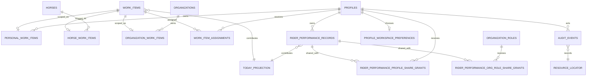
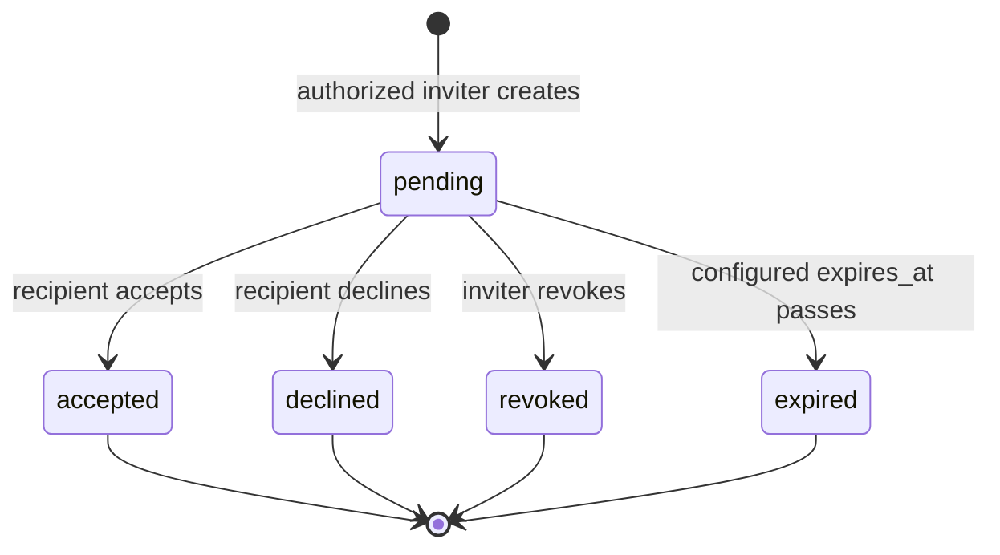
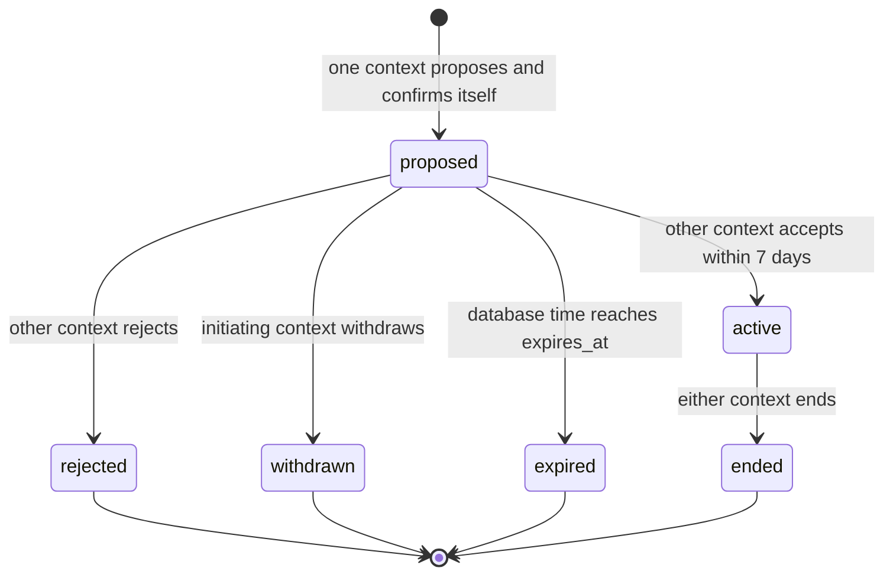
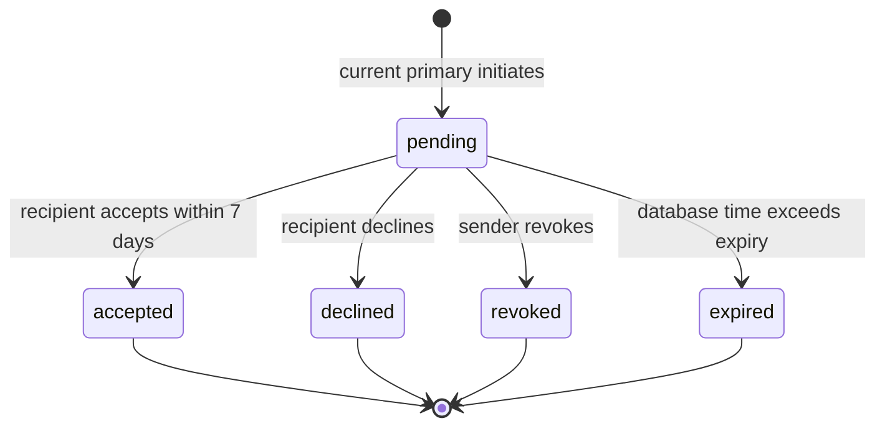

# AVARYN Account Model v2 — Technical Contract

## A. Status en bronhiërarchie

| Veld | Waarde |
| --- | --- |
| Document | AVARYN Account Model v2 Technical Contract |
| Versie | 1.1-proposed (C-002A reviewcorrectie) |
| Status | **Proposed – awaiting Silas approval** |
| Datum | 2026-08-04 |
| Taak | C-002A |
| Basisbranch | `snapshot/latest-alpha-2026-08-04` |
| Basiscommit | `1634ef281084a76ae862fcb595dff8b08048ff48` |
| Architectuurbranch | `architecture/account-model-v2-contract` |
| FlutterFlow-project | `a-v-a-r-y-n-alpha-ynvyuq` |
| FlutterFlow-revisie | `LOTvjLR6TzQjoalLhZWh` |

Dit document specificeert het doelmodel. Het implementeert geen database,
Supabase-, FlutterFlow- of applicatiefunctionaliteit. Tabellen, constraints,
helpers en RPC's zijn voorgestelde contractnamen; codeblokken zijn pseudocode.

### Bronhiërarchie

Bij tegenstrijdigheid geldt, van hoog naar laag:

1. De bindende productbesluiten en formele reviewcorrecties in taak C-002A.
2. De bindende uitkomst van de read-only C-001-architectuuraudit.
3. Dit technische contract na expliciete goedkeuring door Silas.
4. Concrete beveiligings- en integriteitspatronen uit de huidige code.
5. Oudere fase-4- en fase-5-documentatie voor zover die niet strijdig is met
   Account Model v2.

De oude regel dat `stable_id` de universele tenantgrens is, is voor v2
vervallen. De bestaande een-op-een Auth/profilegrens, server-side
autorisatie, RPC-only kritieke writes, RLS, idempotentie, append-only audit en
private-media-aanpak blijven waardevolle technische precedenten, maar moeten
op de nieuwe scopes worden toegepast.

De complete Master Productblauwdruk is niet als zelfstandig bestand in deze
repository aanwezig. Dit document reconstrueert die blauwdruk niet en is
zelfstandig normatief voor de technische Account Model v2-kern.

### Soorten uitspraken

- **Productregel:** bindend gedrag uit C-002 en C-002A; techniek mag dit niet
  wijzigen.
- **Codebewijs:** bewezen eigenschap van de huidige implementatie; alleen
  herbruikbaar wanneer passend bij v2.
- **Technische ontwerpkeuze:** voorgestelde implementatiegrens in dit contract;
  wordt bindend na Silas' goedkeuring.

## B. Begrippenlijst

| Begrip | Definitie |
| --- | --- |
| Personal profile | Het duurzame persoonlijke AVARYN-profiel van één natuurlijke persoon. Het heeft een eigen duurzame UUID en is tijdens de actieve accountfase via een unieke Auth-user-UUID één-op-één gekoppeld. |
| Authenticated user | De actuele, door Supabase Auth geverifieerde sessie. Alleen een authenticated user kan rechtstreeks inloggen. |
| Organization account | Een zelfstandig, duurzaam en overdraagbaar account voor een stal of professionele organisatie, zonder eigen credentials. |
| Organization membership | Een tijdgebonden koppeling tussen een personal profile en een organization account. Een membership alleen verleent geen onbeperkte rechten. |
| Canonical horse account | Het zelfstandige, duurzame paardenrecord dat niet van een stal of organisatie afhankelijk is en geen credentials heeft. |
| Legal owner | Een personal profile of organization account dat als eigenaar van een paard is geregistreerd. Dit is geen juridisch bewijs en verleent niet automatisch beheerrechten. |
| Primary Horse Authority | Precies één actief personal profile dat binnen AVARYN het primaire beheer en de overdrachtsbevoegdheid over een actief paard heeft. |
| Delegated horse administrator | Een personal profile met een expliciete, tijdgebonden gedelegeerde horse-authorityrol. Delegatie wijzigt nooit de primary Horse Authority. |
| Horse relationship | Een semantische, eventueel tijdgebonden relatie tussen een paard en een persoon, zoals rider, trainer, groom, verzorger of behandelaar. Op zichzelf verleent zij geen toegang. |
| Organization-horse link | Een wederzijds bevestigde, tijdgebonden professionele koppeling tussen een organization account en een paard. Beide contexten bevestigen afzonderlijk; ook een actieve koppeling verleent op zichzelf geen toegang. |
| Horse residency | De afzonderlijke historische registratie van het fysieke verblijf van een paard bij een organization van type `stable`. Een paard mag zonder residency bestaan en residency verleent geen toegang. |
| Permission | Een server-side gedefinieerde, atomische capability, bijvoorbeeld `horse.profile.edit` of `organization.memberships.manage`. |
| Scope | De concrete resource waarop een permission geldt: personal profile, horse of organization. Scope wordt server-side vastgesteld. |
| Assignment | De expliciete koppeling van een work item aan een personal profile dat het moet uitvoeren of opvolgen. |
| Workspace | Een clientgekozen beheercontext voor personal profile, horse of organization. Een workspace is nooit een autorisatiebron. |
| Today-item | Een read-only projectie van één unieke verplichting die in persoonlijk Today zichtbaar is. Het is geen zelfstandig bronrecord. |
| Transfer | Een zeven dagen geldig, intrekbaar en expliciet te accepteren verzoek om primary Horse Authority of primaire organisatiebeheerder atomair over te dragen. |
| Invitation | Een eenmalig, tijdgebonden verzoek om een membership of expliciete access grant te accepteren. Een invitation is geen authority totdat acceptatie server-side slaagt. |
| Audit event | Een onveranderbaar, append-only bewijsrecord van een beveiligings- of lifecyclewijziging. |
| Access version | Een server-side beheerde, monotoon stijgende versie op profile, horse en organization voor cache-invalidatie, realtime-revocation en projectieverversing; nooit een vervanging voor actuele RLS-controles. |

## C. ERD

De ERD gebruikt bewust aparte tabellen voor persoons- en organisatievarianten
van eigendom, relaties en grants. Daardoor heeft iedere verwijzing een echte
foreign key. Generieke `subject_type`/`subject_id`-paren worden niet gebruikt
voor autorisatie.

```mermaid
erDiagram
    AUTH_USERS o|--|| PROFILES : authenticates

    ORGANIZATION_TYPES ||--o{ ORGANIZATIONS : classifies
    ORGANIZATIONS ||--o{ ORGANIZATION_MEMBERSHIPS : has
    PROFILES ||--o{ ORGANIZATION_MEMBERSHIPS : joins
    PROFILES ||--o{ ORGANIZATIONS : primary_admin_of
    ORGANIZATIONS ||--o{ ORGANIZATION_ROLES : defines
    ORGANIZATION_ROLES ||--o{ ORGANIZATION_ROLE_PERMISSIONS : includes
    PERMISSION_DEFINITIONS ||--o{ ORGANIZATION_ROLE_PERMISSIONS : defines
    ORGANIZATION_MEMBERSHIPS ||--o{ ORGANIZATION_MEMBERSHIP_ROLES : receives
    ORGANIZATION_ROLES ||--o{ ORGANIZATION_MEMBERSHIP_ROLES : assigns
    PROFILES ||--o{ HORSES : primary_authority_of
    HORSES ||--o{ HORSE_DELEGATED_ADMINISTRATORS : delegates
    PROFILES ||--o{ HORSE_DELEGATED_ADMINISTRATORS : administers
    HORSES ||--o{ HORSE_PERSON_OWNERSHIPS : owned_by
    PROFILES ||--o{ HORSE_PERSON_OWNERSHIPS : owns
    HORSES ||--o{ HORSE_ORGANIZATION_OWNERSHIPS : owned_by
    ORGANIZATIONS ||--o{ HORSE_ORGANIZATION_OWNERSHIPS : owns

    HORSE_RELATIONSHIP_TYPES ||--o{ HORSE_PERSON_RELATIONSHIPS : classifies
    HORSES ||--o{ HORSE_PERSON_RELATIONSHIPS : relates
    PROFILES ||--o{ HORSE_PERSON_RELATIONSHIPS : participates
    ORGANIZATION_HORSE_LINK_TYPES ||--o{ ORGANIZATION_HORSE_LINKS : classifies
    ORGANIZATIONS ||--o{ ORGANIZATION_HORSE_LINKS : links
    HORSES ||--o{ ORGANIZATION_HORSE_LINKS : links
    ORGANIZATIONS ||--o{ HORSE_RESIDENCIES : houses
    HORSES ||--o{ HORSE_RESIDENCIES : resides

    HORSES ||--o{ HORSE_PROFILE_PERMISSION_GRANTS : scopes
    PROFILES ||--o{ HORSE_PROFILE_PERMISSION_GRANTS : receives
    PERMISSION_DEFINITIONS ||--o{ HORSE_PROFILE_PERMISSION_GRANTS : grants
    HORSE_PERSON_RELATIONSHIPS o|--o{ HORSE_PROFILE_PERMISSION_GRANTS : may_bind
    HORSES ||--o{ HORSE_ORGANIZATION_ROLE_PERMISSION_GRANTS : scopes
    ORGANIZATION_ROLES ||--o{ HORSE_ORGANIZATION_ROLE_PERMISSION_GRANTS : receives
    PERMISSION_DEFINITIONS ||--o{ HORSE_ORGANIZATION_ROLE_PERMISSION_GRANTS : grants
    ORGANIZATION_HORSE_LINKS o|--o{ HORSE_ORGANIZATION_ROLE_PERMISSION_GRANTS : may_bind

    ORGANIZATIONS ||--o{ ORGANIZATION_INVITATIONS : invites
    ORGANIZATION_ROLES ||--o{ ORGANIZATION_INVITATIONS : proposes
    HORSES ||--o{ HORSE_ACCESS_INVITATIONS : invites
    HORSE_ACCESS_INVITATIONS ||--o{ HORSE_ACCESS_INVITATION_PERMISSIONS : proposes
    PERMISSION_DEFINITIONS ||--o{ HORSE_ACCESS_INVITATION_PERMISSIONS : defines
    HORSES ||--o{ HORSE_AUTHORITY_TRANSFERS : transfers
    ORGANIZATIONS ||--o{ ORGANIZATION_AUTHORITY_TRANSFERS : transfers
    PROFILES ||--o{ HORSE_AUTHORITY_TRANSFERS : receives
    PROFILES ||--o{ ORGANIZATION_AUTHORITY_TRANSFERS : receives
```





`TODAY_PROJECTION` en `RESOURCE_LOCATOR` zijn logische contracttypen, geen
voorgestelde tabellen. Audit resource-identifiers zijn met opzet immutable
snapshots zonder cascade-FK, zodat bewijs na anonimisering of archivering
blijft bestaan. Ze worden nooit voor autorisatie gebruikt.

## D. Datadictionary

Alle duurzame identifiers zijn UUID's. Timestamps zijn timezone-aware en in
UTC. Lifecycleberekening gebruikt de databasetijd. Echte verwijdering is niet
de normale lifecyclehandeling; status, eindtijd en anonimisering zijn leidend.

### Identiteit en organisaties

| Tabel | Contract |
| --- | --- |
| `profiles` | **Verantwoordelijkheid/eigenaar:** persoonlijk account; eigenaar is de persoon. **PK:** duurzame `id` UUID. **FK:** unieke nullable `auth_user_id` naar `auth.users.id` met `ON DELETE SET NULL`; alleen de trusted deletionflow mag de koppeling verbreken. **Verplicht:** `display_name`, `time_zone`, `status`, `access_version BIGINT NOT NULL DEFAULT 1`, `created_at`, `updated_at`, `row_version`; `auth_user_id` is verplicht zolang status active/deletion_pending is. **Optioneel:** avatarpad, locale, telefoon en anonymized timestamp. **Constraints/index:** geldige IANA-timezone; één profile per Auth-user; `access_version >= 1`; anonymized vereist null `auth_user_id`; indexes op auth user en status. **Lifecycle:** active, deletion_pending, auth_removal_pending, anonymized. **Bewaring/audit:** de duurzame profile UUID mag historische horse/org/auditrelaties blijven dragen; identificerende accountdata volgt het deletioncontract; authority-, share- en anonymiseringswijzigingen auditen. |
| `organization_types` | **Verantwoordelijkheid:** gecureerde typen `stable`, `trainer_practice`, `farrier_business`, `veterinary_practice`, `other_professional`. **PK:** UUID. **Verplicht:** immutable code, label, active. **Uniek/index:** unieke code. **Eigenaar:** platform. **Bewaring:** permanent referentiedata; wijzigingen auditen. |
| `organizations` | **Verantwoordelijkheid/eigenaar:** zelfstandig organization account; record owner is de organisatie. **PK:** UUID. **FK:** organization type en verplichte `primary_admin_profile_id` naar een bestaand profile, met delete-restrictgedrag. **Verplicht:** name, status, `primary_admin_profile_id`, `access_version BIGINT NOT NULL DEFAULT 1`, row_version, timestamps. **Optioneel:** description, contactdisplaydata, archived_at. **Constraints/index:** status active/archived; `access_version >= 1`; index type+status, primary admin en namezoekveld. Creatie gebeurt atomair met actieve membership en verplichte head-adminrol. Directe clientwijziging van `primary_admin_profile_id` is verboden. **Bewaring/audit:** duurzaam; archiveren in plaats van verwijderen; wijzigingen en primary-adminoverdracht altijd auditen. |
| `organization_memberships` | **Verantwoordelijkheid:** persoon-organisatiekoppeling. **PK:** UUID. **FK:** organization, profile. **Verplicht:** status, valid_from, created_at, row_version. **Optioneel:** valid_until, ended_reason. **Constraints/index:** `valid_until > valid_from`; maximaal één overlappende actieve membership per profile/organization; indexes op organization+status en profile+status. **Eigenaar:** organisatie. **Bewaring/audit:** historie behouden; create/activate/suspend/end auditen. |
| `permission_definitions` | **Verantwoordelijkheid:** platformcatalogus van atomische capabilities en toegestane scope. **PK:** UUID. **Verplicht:** immutable code, scope kind, action class, grantable flag. **Uniek:** permission code. **Eigenaar:** platform. **Bewaring:** niet verwijderen wanneer gebruikt; cataloguswijzigingen auditen. |
| `organization_roles` | **Verantwoordelijkheid:** systeem- of organisatiespecifieke rol. **PK:** UUID. **FK:** organization optioneel voor system template. **Verplicht:** code, name, status, is_system. **Constraints:** unieke code binnen organization of systemnamespace. **Index:** organization+status. **Eigenaar:** organization of platform. **Bewaring/audit:** gebruikte rollen archiveren; wijzigingen auditen. |
| `organization_role_permissions` | **Verantwoordelijkheid:** expliciete permissionbundel van een rol. **PK:** UUID. **FK:** organization role, permission definition. **Verplicht:** created_at. **Uniek:** role+permission. **Eigenaar:** organization/platform. **Bewaring/audit:** historie via audit; add/remove auditen. |
| `organization_membership_roles` | **Verantwoordelijkheid:** tijdgebonden roltoekenning aan membership. **PK:** UUID. **FK:** membership, organization role. **Verplicht:** status, valid_from, granted_by_profile_id, created_at. **Optioneel:** valid_until, revoked_by, reason. **Constraints:** role en membership behoren tot dezelfde organization; geldig tijdvenster; geen overlappende identieke actieve assignment. **Indexes:** membership+status, role+status. **Eigenaar:** organization. **Bewaring/audit:** grant/revoke/expire bewaren en auditen. |

`organizations.primary_admin_profile_id` is de enige actuele bron voor de
primaire organisatiebeheerder. Historie staat in transfers en audit, niet in
een tweede actieve authoritytabel. Een deferred constraint trigger of
functioneel gelijkwaardige server-side invariant controleert aan het einde van
iedere transactie dat deze profile een actieve membership en de verplichte
head-adminrol in dezelfde organization heeft. Zolang de profile nog als
`primary_admin_profile_id` staat geregistreerd, mogen dat membership en die rol
niet worden beëindigd, geschorst of ingetrokken.

### Paarden, eigendom, relaties en toegang

Account Model v2 slaat in deze eerste versie geen documenten op die juridisch
eigendom zouden bewijzen. UI en API-projecties tonen bij ownershipregistraties
de vastgelegde disclaimerversie: AVARYN registreert een verklaring en
presenteert die niet als juridisch eigendomsbewijs.

| Tabel | Contract |
| --- | --- |
| `horses` | **Verantwoordelijkheid/eigenaar:** canonical horse account; eigenaar van horse-profieldata is het paardaccount. **PK:** UUID. **FK:** verplichte `primary_authority_profile_id` naar een bestaand profile met `ON DELETE RESTRICT` of functioneel gelijkwaardig gedrag. **Verplicht:** display_name, lifecycle_status, `primary_authority_profile_id`, `access_version BIGINT NOT NULL DEFAULT 1`, `authority_version BIGINT NOT NULL DEFAULT 1`, row_version, timestamps. **Optioneel:** geboortedatum, sex, breed en archived_at. **Constraints:** scalar non-null FK maakt nul of meerdere actuele primary authorities onmogelijk; beide versions zijn minimaal 1; geen organization/stable FK. Een horse wordt uitsluitend atomair met primary authority aangemaakt. Directe clientwijziging van `primary_authority_profile_id` is verboden. **Indexes:** lifecycle status, primary authority, normaliseerde naam. **Bewaring/audit:** duurzaam; identiteit niet verwijderen bij stalwissel of persoonsanonimisering. |
| `horse_delegated_administrators` | **Verantwoordelijkheid:** expliciet, tijdgebonden gedelegeerd paardenbeheer; nooit primary authority. **PK:** UUID. **FK:** horse, delegated profile, grantor profile. **Verplicht:** status, permissionbereik/rol, valid_from, created_at. **Optioneel:** valid_until, ended_reason, ended_by. **Constraints:** geen `horse.transfer`; geldig tijdvenster; geen overlappende identieke actieve delegatie. **Indexes:** horse+status en profile+status. **Eigenaar:** horse. **Bewaring/audit:** historie behouden; grant, wijziging en einde auditen. |
| `horse_person_ownerships` | **Verantwoordelijkheid:** registratie van een persoon als legal owner. **PK:** UUID. **FK:** horse, profile. **Verplicht:** status, valid_from, disclaimer_version. **Optioneel:** `ownership_percentage`, valid_until, note zonder bewijsclaim. **Checks:** percentage null of tussen 0 en 100 inclusief; eind na begin; geen technische 100%-som. **Index:** horse+status en profile+status. **Eigenaar:** horse. **Bewaring/audit:** historie behouden; create/change/end auditen. |
| `horse_organization_ownerships` | Als persoonsownership, maar de eigenaar-FK wijst naar organization. Dezelfde percentage-, tijd-, index-, disclaimer-, bewaar- en auditregels gelden. |
| `horse_relationship_types` | **Verantwoordelijkheid:** gecureerde persoonlijke relatietypen, minimaal rider, trainer, groom, care en professional treatment. **PK:** UUID. **Verplicht:** code, label, active. **Uniek:** code. **Eigenaar:** platform. **Bewaring:** referentiedata; wijzigingen auditen. Geen permissionmapping. |
| `horse_person_relationships` | **Verantwoordelijkheid:** semantische horse-personrelatie. **PK:** UUID. **FK:** horse, profile, relationship type. **Verplicht:** status, valid_from. **Optioneel:** valid_until, note. **Constraints:** geldig tijdvenster; overlapregels per type expliciet. **Indexes:** horse+type+status, profile+status. **Eigenaar:** horse. **Bewaring/audit:** historie behouden; start/end auditen. Verleent nul impliciete permissions. |
| `organization_horse_link_types` | **Verantwoordelijkheid:** gecureerde typen professionele bedrijfsrelaties, minimaal training provider, veterinary provider, farrier provider, care provider en other. **PK:** UUID. **Verplicht:** code, active. **Uniek:** code. **Eigenaar:** platform. **Bewaring:** referentiedata. Geen residencytype en geen permissionmapping. |
| `organization_horse_links` | **Verantwoordelijkheid:** voorstel en lifecycle van een wederzijds bevestigde professionele organization-horsekoppeling. **PK:** UUID. **FK:** organization, horse, link type, initiërend profile, horse-side actor, organization-side actor, accepterend profile. **Verplicht:** status (`proposed`, `active`, `rejected`, `withdrawn`, `expired`, `ended`), initiërende context (`horse` of `organization`), initiërend profile, `proposed_at`, `expires_at=proposed_at+7 dagen`, bevestiging van de initiërende context met actor en timestamp, correlation ID en timestamps. **Conditioneel verplicht:** beide contextbevestigingen en accepterend profile bij `active`; terminal reason/timestamp bij terminale status; end actor/reason/timestamp bij `ended`. **Constraints:** bij creatie precies één contextbevestiging; activering uitsluitend na twee geldige, afzonderlijk geautoriseerde bevestigingen; terminale voorstellen zijn niet herbruikbaar; directe clientupdates van status/bevestigingsvelden verboden. **Indexes:** horse+status, organization+status, expires_at voor proposed; maximaal één gelijksoortig bruikbaar voorstel/actieve link waar productsemantiek dat vereist. **Eigenaar:** de koppeling. **Bewaring/audit:** alle transitions bewaren en auditen. Verleent nul impliciete toegang. |
| `horse_residencies` | **Verantwoordelijkheid:** afzonderlijke fysieke verblijfsstalhistorie. **PK:** UUID. **FK:** horse en `stable_organization_id` naar organization. **Verplicht:** status/lifecycle, `starts_at`, created/updated metadata. **Optioneel:** `ends_at`, reason en correlation ID. **Constraints/index:** eind na begin; organization moet server-side van type `stable` zijn; partial unique index op horse voor maximaal één actieve residency. Een paard mag nul actieve residencies hebben. **Bewaring/audit:** historische records blijven behouden; openen, beëindigen en atomair wisselen auditen. Verleent nul impliciete toegang. |
| `horse_profile_permission_grants` | **Verantwoordelijkheid:** expliciete horsepermission aan profile. **PK:** UUID. **FK:** horse, grantee profile, permission definition, grantor profile en optioneel `horse_person_relationship_id`. **Verplicht:** status, valid_from, reason, created_at. **Optioneel:** valid_until, revoked fields en relationship-FK. **Constraints:** permission heeft horse scope; tijdvenster geldig; grantor mag alleen grantable permissions binnen eigen delegatiebereik geven; geen actieve duplicate. Wanneer de relationship-FK gevuld is, moeten horse en grantee overeenkomen en is de grant expliciet relatiegebonden. **Indexes:** horse+grantee+status, grantee+status en relationship+status. **Eigenaar:** horse. **Bewaring/audit:** historie behouden; grant/revoke/expire auditen. Einde van de relatie trekt alleen de eraan gebonden actieve grants atomair in. |
| `horse_organization_role_permission_grants` | **Verantwoordelijkheid:** expliciete horsepermission voor leden met een specifieke actieve organization role. **PK:** UUID. **FK:** horse, organization role, permission definition, grantor profile en optioneel `organization_horse_link_id`. **Verplicht/optioneel/constraints:** als profile grant; role moet bij één concrete organization horen; wanneer `organization_horse_link_id` gevuld is, moeten horse en organization overeenkomen en is de grant expliciet linkgebonden. **Indexes:** horse+role+status, role+status en link+status. **Eigenaar:** horse. **Bewaring/audit:** historie behouden. Een organization-horse link is nooit voldoende; deze grant moet apart bestaan. Einde van een link trekt alleen de eraan gebonden actieve grants atomair in. |

### Invitations en transfers

| Tabel | Contract |
| --- | --- |
| `organization_invitations` | **Verantwoordelijkheid:** uitnodiging voor organization membership en één initiële organization role. **PK:** UUID. **FK:** organization, inviter profile, initial organization role; target profile optioneel totdat account veilig is gekoppeld. **Verplicht:** server-side keyed HMAC van de eenduidig genormaliseerde, beoogde e-mailidentiteit, status, expires_at en created_at; `token_digest` is verplicht zolang status `pending` is. **Optioneel:** `token_digest` na terminale status, accepted_by profile en terminal timestamps. **Constraints:** role behoort tot organization; raw e-mail is geen identitybewijs; geen raw token; random hoog-entropisch token; terminale invitation is onveranderlijk en niet herbruikbaar; token-digestunique geldt alleen voor non-nullwaarden. **Indexes:** organization+status, partial unique non-null token digest, target HMAC+status. **Eigenaar:** organization. **Bewaring/audit:** terminal metadata bewaren; token digest mag na terminale afronding worden gewist zonder de auditstatus te wijzigen; alle transitions auditen. Extra roles worden later via de normale role-grantflow toegekend. |
| `horse_access_invitations` | **Verantwoordelijkheid:** uitnodiging voor vooraf vastgelegde horse permissions. **PK:** UUID. **FK:** horse, inviter profile, target profile optioneel. **Verplicht:** dezelfde server-side target-email-HMAC, status, expires_at; `token_digest` zolang status `pending` is. **Optioneel:** nullable token digest na terminale status, accepted_by profile en terminal timestamps. **Constraints:** geen raw token of ongekeyde e-mailhash; acceptatie creëert uitsluitend grants voor de gekoppelde child permissionrecords; terminale invitation is niet herbruikbaar; partial unique op non-null token digest. **Eigenaar:** horse. **Bewaring/audit:** als organization invitation. Geeft nooit primary authority. |
| `horse_access_invitation_permissions` | **Verantwoordelijkheid:** exact permissionbereik van een horse access invitation. **PK:** UUID. **FK:** horse access invitation en permission definition. **Verplicht:** voorgestelde valid_from en optionele valid_until. **Constraints:** alleen horse-scoped grantable permissions; unique invitation+permission; eind na begin. **Eigenaar:** horse. **Bewaring/audit:** met invitationhistorie behouden; acceptatie en uiteindelijke grants correleren via dezelfde correlation ID. |
| `horse_authority_transfers` | **Verantwoordelijkheid:** zeven dagen geldig transferverzoek voor wijziging van `horses.primary_authority_profile_id`. **PK:** UUID. **FK:** horse, sender profile en recipient profile. **Verplicht:** status, `authority_version_at_create`, token digest zolang pending, expires_at=`created_at+7 dagen`, correlation ID. **Constraints:** één bruikbare pending transfer per horse; recipient verschilt van sender; terminal states immutable; geen raw token. **Indexes:** horse+status, recipient+status, partial unique non-null token digest. **Eigenaar:** horse. **Bewaring/audit:** permanent transferbewijs, token digest mag volgens securityretentie na terminale status worden gewist; elke stap auditen. |
| `organization_authority_transfers` | Als horse transfer, maar wijzigt bij acceptatie `organizations.primary_admin_profile_id` en gebruikt de bij creatie vastgelegde organization `access_version` voor optimistic concurrency. Ontvanger krijgt binnen dezelfde transactie zo nodig een actieve membership en verplichte head-adminrol; de invariant wordt deferred aan transactie-einde gecontroleerd. |

### Werk, Today, workspace en Rider Performance

| Tabel | Contract |
| --- | --- |
| `work_items` | **Verantwoordelijkheid:** gedeelde kern voor taken/verplichtingen. **PK:** UUID. **Verplicht:** source module, title, lifecycle status, priority, is_all_day, created_by, timestamps, row_version. **Optioneel:** description, start_at/end_at voor timed items, due_on voor all-day, recurrence source. **Checks:** all-day gebruikt `due_on` en geen start/end; timed gebruikt UTC start; lifecycle open/completed/cancelled. **Indexes:** status+start_at, status+due_on, source module+source id. **Eigenaar:** exact één typed scopetabel hieronder. **Bewaring/audit:** volgens domeinretentie; assignment/statusmutaties auditen. |
| `personal_work_items` | **Verantwoordelijkheid:** profile-owned work scope. **PK/FK:** work_item_id naar work item. **FK:** owner profile. **Constraint:** ieder work item heeft exact één van personal, horse of organization scope. **Index:** owner profile. **Eigenaar:** profile. **Bewaring:** persoonlijke retentie/anonimisering. |
| `horse_work_items` | Als personal scope, maar owner is horse. Horsehistorie blijft intact bij stalwissel of profile-anonimisering. Index op horse. |
| `organization_work_items` | Als personal scope, maar owner is organization. Index op organization. Onverdeelde open items blijven uit persoonlijk Today. |
| `work_item_assignments` | **Verantwoordelijkheid:** expliciete assignment aan persoon. **PK:** UUID. **FK:** work item, assignee profile, assigner profile. **Verplicht:** status, assigned_at. **Optioneel:** accepted/completed/ended timestamps. **Constraints:** maximaal één actieve assignment per work item+profile; assignee moet op het moment van assignment de minimaal vereiste toegang hebben. **Indexes:** assignee+status en work item+status. **Eigenaar:** work-itemscope. **Bewaring/audit:** assignmenthistorie behouden; assign/reassign/end auditen. |
| `profile_workspace_preferences` | **Verantwoordelijkheid:** laatst gekozen beheercontext. **PK/FK:** profile ID. **Verplicht:** workspace kind personal/horse/organization, updated_at. **Optioneel:** horse ID of organization ID in afzonderlijke nullable FKs. **Checks:** exact het veld passend bij kind is gevuld; server valideert actuele toegang bij opslaan én gebruiken. **Index:** geen securityindex nodig. **Eigenaar:** profile. **Bewaring:** mag worden gereset; geen autorisatie- of auditbron, behalve securityrelevante anomalieën. |
| `rider_performance_records` | **Verantwoordelijkheid/eigenaar:** categoriegebonden Rider Performance-data van één profile. **PK:** UUID. **FK:** owner profile. **Verplicht:** category code, occurred_at, lifecycle status, row_version. **Optioneel:** domeinpayload volgens later modulecontract. **Indexes:** owner+category+occurred_at. **Bewaring/audit:** persoonsgegevensbeleid; mutaties en shares auditen. |
| `rider_performance_profile_share_grants` | **Verantwoordelijkheid:** expliciete categorie- of recordshare naar ander profile. **PK:** UUID. **FK:** owner, grantee profile en optioneel record. **Verplicht:** category scope, status, valid_from. **Optioneel:** valid_until. **Constraints:** owner is recordeigenaar; geen duplicate active grant. **Indexes:** grantee+status, owner+status. **Bewaring/audit:** intrekking stopt toekomstig lezen; grant/revokehistorie blijft. |
| `rider_performance_org_role_share_grants` | Als profile share, maar ontvanger is één concrete organization role. Lidmaatschap én rol én share moeten tegelijk actief zijn. Een organization membership alleen geeft geen toegang. |
| `audit_events` | **Verantwoordelijkheid:** immutable security- en lifecyclebewijs. **PK:** UUID. **Technische actoridentiteit:** duurzame actor profile UUID of stabiele system-actorcode; geen cascade-FK naar actor, scope of resource. **Verplicht:** actorsoort en technische actoridentiteit, event type, resource kind/id, scope kind/id, allowlisted oude/nieuwe toestand, occurred_at, correlation ID en schema version. **Optioneel:** reason code en strikt allowlisted metadata. **Constraints:** append-only; gewone gebruikers en applicatieclients kunnen niet update/delete; geen onnodige vrije tekst, naam-/e-mailsnapshot, secrets, tokens of signed URLs. **Indexes:** resource+time, actor+time, correlation ID, event type+time. **Eigenaar:** platform/security. **Bewaring:** volgens nog vast te leggen wettelijke/securitytermijn. De UI resolveert de actuele actorweergave en toont na anonimisering een neutraal label; het event zelf blijft ongewijzigd. Eventuele wettelijk vereiste identificerende bewaring hoort in een afzonderlijk streng beperkt retentiemodel buiten deze fase. |

### Uitvoerbare exact-one-invarianten

Een partial unique index kan alleen **maximaal één** actieve rij afdwingen. Hij
kan niet bewijzen dat er ten minste één rij bestaat en is daarom nooit de enige
bescherming voor een exact-one-invariant.

- Primary Horse Authority staat uitsluitend in de verplichte scalar FK
  `horses.primary_authority_profile_id`. De non-null FK met delete-restrict,
  atomische creatie en RPC-only overdracht garandeert dat een horse na iedere
  commit precies één actuele primary authority heeft. Er bestaat geen tweede
  actuele authoritybron.
- De primaire organisatiebeheerder staat uitsluitend in de verplichte scalar
  FK `organizations.primary_admin_profile_id`. Atomische creatie en overdracht
  voorkomen een nullsituatie. De deferred server-side invariant bewijst aan
  transactie-einde bovendien de actieve membership en verplichte head-adminrol.
- De partial unique index op `horse_residencies` is wel passend: de productregel
  is daar **maximaal één** actieve residency en nul is uitdrukkelijk toegestaan.

### Access-versioncontract

`profiles`, `horses` en `organizations` hebben ieder
`access_version BIGINT NOT NULL DEFAULT 1`. De database beheert deze waarde:
zij is monotoon stijgend, daalt nooit en is niet rechtstreeks clientschrijfbaar.
Elke authorizatierelevante mutatie verhoogt in dezelfde transactie de versions
van alle betrokken resources. De versie ondersteunt cache-invalidatie,
realtime-revocation en het ongeldig maken van eerder opgebouwde projecties,
maar vervangt RLS niet. Policies en helpers lezen altijd de actuele brontabellen;
een client met een oude versie behoudt nooit toegang.

`horses.authority_version` blijft afzonderlijk. Deze version stijgt alleen bij
wijziging van de primary Horse Authority en dient voor transferconcurrency; zij
is geen algemene access version en organizations hebben geen authority version.

| Gebeurtenis | Verplicht te verhogen access versions |
| --- | --- |
| Membership, membershiprol of organization-permission wijzigt | Organization en alle profiles waarvan effectieve organizationtoegang wijzigt |
| Primary Horse Authority of delegatie wijzigt | Horse en oude/nieuwe of gedelegeerde betrokken profiles; daarnaast horse `authority_version` alleen bij primarywijziging |
| Horse grant wordt toegekend, gewijzigd, ingetrokken of verloopt | Horse en alle direct of via organization role betrokken grantee profiles |
| Rider Performance share wordt toegekend, gewijzigd, ingetrokken of verloopt | Owner profile en alle betrokken grantee profiles |
| Profile wordt geblokkeerd, deletion-pending of geanonimiseerd | Profile plus iedere horse/organization waarvan effectieve toegang of beheer wijzigt |
| Persoonlijke relatie eindigt met expliciet daaraan gebonden toegang | Horse en betrokken profile; de gebonden grant wordt afzonderlijk ingetrokken |
| Organization-horse link eindigt met afhankelijke linkgebonden grants | Horse, organization en alle profiles met daardoor gewijzigde effectieve toegang |

Een transactie mag meerdere oorzaken samenvoegen tot één monotone increment per
betrokken resource, mits audit en correlation ID exact vastleggen welke
authorizatierelevante wijzigingen die increment afdekt.

### Referentiële-integriteitskeuze

Voor authorization-relevante relaties worden geen polymorfe ID-paren gebruikt.
Varianten hebben aparte tabellen en echte foreign keys. Alleen:

- de read-only `TodayItem`-projectie gebruikt een `source_module` en
  `source_id` als navigatie-/deduplicatielocator; en
- `audit_events` bewaart immutable resource snapshots.

Geen van beide bepaalt toegang. FlutterFlow leest samengestelde gegevens via
getypeerde RPC-resultaten, niet via client-side joins over generieke subjects.

## E. Toegangs- en rechtenmodel

### Auth-koppeling

`auth.uid()` moet via de unieke `profiles.auth_user_id` exact één actief
personal profile opleveren. De duurzame `profiles.id` blijft na gecontroleerde
anonimisering bruikbaar voor referentiële historie, terwijl de Auth-koppeling
wordt verwijderd. E-mail, display name, OAuth-metadata, workspacekeuze en
clientclaims zijn nooit identifiers of autorisatiebronnen.

### Persoonlijke records

De persoon mag eigen profiel en persoonlijke records lezen binnen het
datacategoriecontract. Bewerken gebeurt rechtstreeks alleen voor expliciet
veilige profielvelden; gevoelige lifecycle-, share- en deletionhandelingen
gaan via beveiligde RPC's.

### Organisatietoegang

Organisatietoegang vereist gelijktijdig:

1. een geauthenticeerd profile;
2. een actieve, tijdgeldige organization membership;
3. een actieve, tijdgeldige membership role;
4. de vereiste permission in die rol; en
5. een actieve organization en actuele bronrecords onder RLS.

De primaire organisatiebeheerder wordt uitsluitend uit
`organizations.primary_admin_profile_id` afgeleid, nooit uit clientstate, een
bewerkbare rolnaam of een tweede actieve assignmenttabel. De server controleert
daarnaast de verplichte actieve membership en head-adminrol.

### Paardtoegang

Paardtoegang bestaat uitsluitend via één van deze paden:

1. `horses.primary_authority_profile_id` verwijst naar de actor;
2. actieve delegated horse administrator met passende expliciete permission;
3. actieve directe profile permission grant;
4. actieve organization membership + actieve role + actieve expliciete
   horse/organization-role permission grant.

Legal ownership, horse relationship, organization-horse link, residency,
assignment of geselecteerde workspace verleent op zichzelf geen algemene
paardtoegang. Een assignment mag alleen de minimale taakuitvoeringsvelden
openen die in het work-itemcontract zijn vastgelegd; het is geen algemene
horse grant.

### Permissionklassen

Permissions zijn atomair en resourcegescoped. Minimaal:

- `view`: minimale gegevens lezen;
- `edit`: bestaande domeingegevens wijzigen;
- `manage`: lifecycle, relaties of grants beheren binnen een expliciet bereik;
- `assign`: work items toewijzen;
- `share`: datacategorieën met een andere principal delen;
- `transfer`: primary authority overdragen.

`transfer` is nooit inbegrepen in delegated horse administration of een
gewone organization adminrol.

### Rechtenmatrix

`C` betekent conditioneel: alleen wanneer een expliciete permission voor de
concrete scope bestaat.

| Actor/rol | Scope | View | Edit | Manage | Assign | Share | Transfer |
| --- | --- | --- | --- | --- | --- | --- | --- |
| Profile zelf | Personal | Ja | Ja | Ja, eigen lifecyclegrenzen | Ja | Ja, Rider Performance per categorie | n.v.t. |
| Andere profile met share | Personal/Rider Performance | C | Nee, tenzij apart ontworpen | Nee | Nee | Nee | Nee |
| Primary Horse Authority | Horse | Ja | Ja | Ja | Ja | Ja | Ja |
| Delegated horse administrator | Horse | Ja | C | C | C | C | **Nee** |
| Direct horse grantee | Horse | C | C | C | C | C | Nee |
| Horse relationship zonder grant | Horse | Nee | Nee | Nee | Nee | Nee | Nee |
| Organization-horse link zonder grant | Horse | Nee | Nee | Nee | Nee | Nee | Nee |
| Horse residency zonder grant | Horse | Nee | Nee | Nee | Nee | Nee | Nee |
| Organization role met horse grant | Horse | C | C | C | C | C | Nee |
| Primaire organisatiebeheerder | Organization | Ja | Ja | Ja | Ja | Ja | Ja |
| Organization adminrole | Organization | Ja | C | C | C | C | Nee |
| Organization member/viewer | Organization | C | C | C | C | C | Nee |
| Beëindigde membership/role/grant | Iedere scope | Nee | Nee | Nee | Nee | Nee | Nee |

### Toekennen en intrekken

- Alleen de database bepaalt of de actor een permission mag toekennen.
- De actor mag nooit meer delegeren dan de eigen grantable permission set.
- Een revoke/end schrijft status en eindtijd, verhoogt alle in het
  access-versioncontract aangewezen versions en schrijft audit in één
  transactie.
- Iedere accesshelper controleert actuele status en tijdvenster van alle
  afhankelijke records.
- Semantische relaties mogen geen verborgen permissiontrigger hebben.

### Preventie van privilege escalation

- Kritieke mutaties zijn RPC-only; tabellen weigeren directe clientwrites.
- Actor, scope, grantor, huidige authority en row version worden server-side
  herleid of opnieuw gevalideerd.
- Geen businessrollen uit JWT user metadata, e-mail, FlutterFlow state of
  requestpayload vertrouwen.
- RPC's gebruiken locks, idempotency/correlation IDs en optimistic versions
  waar races mogelijk zijn.
- SECURITY DEFINER wordt alleen gebruikt wanneer caller-RLS onvoldoende is,
  met minimale eigenaar, volledig gekwalificeerde objectnamen en een lege of
  strikt vaste `search_path`.
- Service-rolecode voert dezelfde actor- en scopechecks uit en accepteert geen
  door de client beweerde actor.

`stable_id` mag geen impliciete rechtenbron meer zijn, omdat verblijf een
veranderlijke semantische relatie is en paardidentiteit, legal ownership en
authority onafhankelijk moeten blijven.

## F. RLS-contract

### Verplichte helpers

Conceptuele helpers, bij voorkeur in een niet-clienttoegankelijk schema:

- `current_profile_id()` — valideert `auth.uid()` en actieve profile status.
- `has_personal_permission(profile_id, permission_code)`.
- `has_organization_permission(organization_id, permission_code, at_time)`.
- `has_horse_permission(horse_id, permission_code, at_time)`.
- `is_primary_horse_authority(horse_id)`.
- `is_primary_organization_authority(organization_id)`.
- `can_grant_horse_permission(horse_id, permission_code)`.
- `can_assign_work_item(work_item_id, assignee_profile_id)`.
- `can_view_work_item(work_item_id)`.
- `can_view_rider_performance(record_id, category_code)`.
- `can_confirm_organization_horse_link(link_id)` — leidt de
  bevestigende context server-side af en vereist de passende horse- of
  organizationpermission voor die concrete context.

Helpers zijn fail-closed, side-effectvrij, gebruiken databasetijd en volgen
geen semantische relation/link als permission.

### Beleid per gegevenstype

| Gegevenstype | SELECT | INSERT | UPDATE | DELETE | RPC/helpercontract |
| --- | --- | --- | --- | --- | --- |
| Profile | Eigen profile; gedeelde minimale velden alleen via doel-RPC | Auth-provisioningtrigger | Eigen allowlisted displayvelden; lifecycle niet direct | Nooit client-side | Provision, deletion request en anonimisering via beveiligde RPC/serviceflow |
| Organization/type | Types leesbaar voor authenticated; organization alleen met `organization.view` of geldige invite-previewprojectie | Organization + primary admin + membership + head-adminrol atomair via RPC | `organization.edit` via versioned RPC | Geen hard delete | Membership/primary-adminhelpers verplicht |
| Membership/roles | Alleen met eigen membershipinzage of `memberships.view/manage` | Invite acceptance of management-RPC | Suspend/end/rolewijziging via RPC | Geen hard delete | Controleer actieve head/adminpermission, target en version |
| Horse | Alleen `horse.view` | Horse + primary authority atomair via RPC | Per categorie via versioned RPC | Geen hard delete; archive RPC | `has_horse_permission`; geen stable fallback |
| Authority/ownership | Alleen relevante horse/org permission en minimale eigen inzage | Uitsluitend create/transfer/registration RPC | Scalar primary-FK alleen via transfer-RPC; ownership via RPC | Nooit | Locks, scalar exact-one invariant, legal-ownerdisclaimer en audit |
| Relationships/links/residencies | Alleen relevante viewpermission; betrokkene krijgt alleen expliciet toegestaan minimum | Manage-/propose-RPC | Confirm/reject/withdraw/end/wissel uitsluitend via RPC | Geen hard delete | Relatie/link/residency geeft geen access; context, type, status en tijdvenster controleren |
| Permission grants | Eigen ontvangen grantmetadata minimaal; managers volgens scope | Grant-RPC | Revoke/end RPC | Geen hard delete | `can_grant_*`; actor kan grantbereik niet vergroten |
| Invitations | Alleen veilige previewprojectie of scoped managerlisting | Create-RPC | Accept/decline/revoke/expire RPC | Geen client delete | Raw token nooit selecteren; verified Auth-email via keyed HMAC; terminal status eenmalig |
| Transfers | Sender/recipient en bevoegde scopemanager; token nooit selecteren | Initiate-RPC | Accept/reject/revoke/expire RPC | Nooit | Locks, version, zeven dagen, atomic authority swap |
| Work items | Via typed owner scope of minimale directe assignmentprojectie | Scope-create RPC | Versioned domein-RPC | Cancel/archive, geen hard delete | Exact één typed scope; assignment opent geen volledig horse/org record |
| Assignments | Assignee en bevoegde scopemanager | Assignment-RPC | Accept/complete/end RPC | Geen hard delete | Assignee en onderliggende scope opnieuw autoriseren |
| Workspace preference | Alleen eigen record | Eigen upsert | Eigen upsert na actuele scopecheck | Eigen reset toegestaan | Clientwaarde nooit gebruiken als accessbewijs |
| Rider Performance | Eigen records; shareontvanger alleen gedeelde categorie/record | Eigen module-RPC | Eigen versioned RPC | Retentie-/anonimiseringsflow | Share moet actief zijn; orgontvanger vereist actieve membership+role |
| Audit events | Alleen expliciete auditpermission of minimale eigen securitytimeline | Alleen trusted RPC/function | Nooit | Nooit | Append-only writer; metadata-allowlist en correlation ID |

### Database-only controles

Altijd in de database:

- profile uit `auth.uid()`;
- status- en tijdvensterchecks;
- same-organization role-integriteit;
- exact één typed work-itemscope;
- verplichte scalar primary authority/admin-FK's en de deferred primary-admin
  membership/rolinvariant;
- horse authority-version of organization access-version bij transfer, plus
  expiry;
- grantability en scope van permission;
- maximaal één actieve residency en alleen naar organizationtype `stable`;
- ownership percentage 0–100;
- row-version/concurrencybeslissingen;
- auditinsert als onderdeel van de mutatietransactie.

### Realtime

Realtime publiceert geen gevoelige domeinpayloads. Events zijn private
wake-upsignalen met minimale resource locator en access version. De client
haalt data opnieuw op onder actuele RLS. Revoke/end verhoogt de in het
access-versioncontract aangewezen profile-, horse- en organizationversions
voordat de transactie slaagt.
Een bestaande subscription is nooit blijvend bewijs van toegang.

## G. Lifecycle en state machines

Terminale statussen zijn onveranderlijk. Een retry met dezelfde correlation ID
retourneert dezelfde uitkomst en voert geen tweede mutatie uit.

### Organization invitation



- **Actor:** uitnodiger met `organization.memberships.manage`; alleen target
  recipient accepteert/afwijst.
- **Identitybewijs:** voorspelbare e-mailadressen worden nooit met een gewone
  ongekeyde hash geautoriseerd. Uitgifte en acceptatie gebruiken dezelfde
  server-side normalisatie en een keyed HMAC over de door Auth geverifieerde
  e-mailidentiteit. De HMAC-sleutel is niet beschikbaar voor FlutterFlow,
  clients of publieke SQL-rollen.
- **Acceptatie:** actor is ingelogd; server verifieert dat de gekoppelde
  Auth-identiteit een verified e-mailadres heeft waarvan de HMAC overeenkomt.
  Een clientaangeleverd e-mailadres is onvoldoende. Token, target identity,
  organization status en initiële rollen worden opnieuw gecontroleerd;
  membership en roles worden atomair gemaakt/geactiveerd.
- **Token:** random en hoog-entropisch; alleen de digest wordt opgeslagen.
  `token_digest` is non-null zolang de invitation pending is en mag na een
  terminale transition worden gewist. Alleen aanwezige digests zijn uniek en
  wissen maakt een terminale invitation nooit herbruikbaar.
- **Fout:** volledige transactie rollback; pending blijft bruikbaar zolang niet
  verlopen.
- **Audit:** created, accepted, declined, revoked, expired.

### Organization membership

`invited/pending → active → suspended → active` of `active/suspended → ended`.

- Alleen bevoegde organizationmanager mag suspend/resume/end uitvoeren; de
  persoon mag volgens productflow zelf vertrekken wanneer geen blokkerende
  `primary_admin_profile_id`-aanwijzing bestaat.
- End/suspend beëindigt effectieve roles en verhoogt de in het
  access-versioncontract aangewezen organization- en profileversions atomair.
- De primaire organisatiebeheerder kan niet vertrekken vóór geldige transfer.
- Membership of verplichte head-adminrol van
  `organizations.primary_admin_profile_id` kan niet worden geschorst,
  beëindigd of ingetrokken zolang de scalar FK niet atomair is overgedragen.
- Fout betekent geen gedeeltelijke role- of accesswijziging.

### Horse relationship en permission grant

- Relationship: `planned → active → ended`, of `planned → cancelled`; expired
  wordt afgeleid of expliciet vastgelegd.
- Permission grant: `pending/active → revoked/expired/ended`.
- Relatieovergangen maken of verruimen nooit impliciet grants. Alleen een
  expliciet relatiegebonden grant wordt bij relatie-einde atomair ingetrokken;
  niet-gebonden grants blijven afzonderlijk beheerd.
- Revoke/end verhoogt de in het access-versioncontract aangewezen horse- en
  profileversions en schrijft audit.
- Herstel bij fout: transactie rollback; client haalt actuele row version op.

### Horse residency

Residency gebruikt `planned → active → ended` of `planned → cancelled`. Een
horse mag zonder residency bestaan. Openen valideert server-side dat de
organization van type `stable` is. Een stalwissel lockt de horse en betrokken
residencyrecords, beëindigt de bestaande actieve residency en opent de nieuwe
binnen één transactie. De partial unique index op actieve residency voorkomt
meer dan één actieve rij; historische records blijven behouden. Geen transition
maakt of wijzigt permissions.

### Organization-horse link



- Horse- of organizationcontext mag voorstellen. Het initiërende personal
  profile moet de vereiste permission voor die context hebben; bij creatie
  wordt uitsluitend die contextbevestiging geregistreerd.
- De andere context accepteert expliciet via een personal profile met de voor
  die accepterende context vereiste permission. De server leidt uit link en
  actor af namens welke context wordt gehandeld. Een client kan die context
  niet kiezen of spoofen.
- Een profile dat beide kanten legitiem vertegenwoordigt, moet per context
  afzonderlijk de juiste actuele permission hebben. De twee bevestigingen
  blijven contextgebonden, ook wanneer dezelfde profile beide handelingen doet.
- Activering vereist beide geldige bevestigingen en gebeurt atomair en
  idempotent. Directe status- of bevestigingsupdates zijn verboden.
- Een voorstel verloopt zeven dagen na `proposed_at`. `rejected`, `withdrawn`,
  `expired` en `ended` zijn terminal en kunnen niet worden geactiveerd of
  hergebruikt. De initiërende kant kan alleen vóór acceptatie intrekken.
- Beide kanten mogen een actieve koppeling met de vereiste contextpermission
  beëindigen. Daarbij worden expliciet linkgebonden grants atomair ingetrokken;
  niet-linkgebonden grants blijven afzonderlijk beheerd.
- Iedere transition schrijft actor, context, reden, timestamps en correlation ID
  naar append-only audit. Geen linkstatus verleent ooit horseaccess.

### Primary Horse Authority transfer



Acceptatie lockt horse en transfer. De database
controleert sender, recipient, pending status, expiry en
`authority_version_at_create`. In één transactie:

1. wordt `horses.primary_authority_profile_id` van sender naar recipient
   gewijzigd;
2. blijft de verplichte scalar FK op ieder commitmoment non-null en geldig;
3. wordt de transfer accepted;
4. stijgen horse `authority_version` en de toepasselijke horse/profile
   `access_version`-waarden; en
5. worden audit events geschreven.

Afwijzing, intrekking en expiry veranderen authority niet. Geen terminale
transfer kan opnieuw worden gebruikt.

### Organization head transfer

Dezelfde state machine en atomiciteitsregels gelden. Acceptatie lockt
organization en transfer, controleert de vastgelegde `access_version`, maakt of
activeert zo nodig de recipient membership en verplichte head-adminrol, wijzigt
`organizations.primary_admin_profile_id` en verhoogt de toepasselijke
organization/profile access versions binnen dezelfde transactie. Het transfer-
RPC mag hiervoor beheerder, memberships en rollen samen wijzigen. De deferred
invariant controleert aan transactie-einde de nieuwe beheerder, actieve
membership en vereiste rol. De verplichte scalar FK voorkomt nul of meerdere
actuele primary admins; er is geen tweede actieve primary-adminrij.

### Account deletion en anonimisering

Persistente statusflow:
`active → deletion_pending → auth_removal_pending → anonymized`. Wanneer een
blocker bestaat, retourneert de requestflow `blocked` met concrete codes en
blijft het profile `active`; `blocked` is geen duurzame profilestatus.

- **Actor:** alleen de persoon start; trusted deletionservice voert uit.
- **Blockers:** profile staat nog in een
  `horses.primary_authority_profile_id` of
  `organizations.primary_admin_profile_id`; open transfer is geen vervanging
  voor acceptatie. Eerst is een geldige overdracht verplicht.
- **Voorwaarden:** noodzakelijke data classificeren en ownership/horse/org-
  historie los van credentials bewaren.
- **Databasevoorbereiding:** één transactie blokkeert nieuwe applicatietoegang,
  beëindigt actieve delegaties, memberships, membershiprollen en operationele
  horse-personrelaties, trekt permission grants en Rider Performance shares in,
  trekt open invitations en transfers in, verhoogt alle betrokken access
  versions, pseudonimiseert/verwijdert identificerende profielvelden, zet status
  op `auth_removal_pending` en schrijft audit. De Auth-user-UUID blijft alleen
  nog beschikbaar voor de trusted deletionservice.
- **Auth-stap:** de trusted service trekt sessies in en verwijdert de Auth-user.
  Dit is een externe stap en wordt niet onterecht als atomair met PostgreSQL
  voorgesteld. De FK zet `auth_user_id` op null.
- **Finalisatie:** een idempotente databasetransactie verifieert de verbroken
  Auth-koppeling, zet status op `anonymized` en schrijft het terminale audit
  event.
- **Afwijzing:** concrete blocker codes, geen gedeeltelijke verwijdering.
- **Herstel:** bij een fout vóór databasevoorbereiding blijft het account
  ongewijzigd; na voorbereiding hervat de trusted service de Auth-stap en
  finalisatie idempotent via correlation ID. Paarden- en organisatie-identiteit
  blijft intact.
- **Historie:** legal ownership verleent geen toegang en mag naar de duurzame
  geanonimiseerde profile UUID blijven verwijzen. Audit events worden niet
  herschreven; de UI toont een neutrale geanonimiseerde actorweergave zonder
  bewaarde algemene naam- of e-mailsnapshot.

## H. Workspace- en Today-contract

### Workspace

De client mag lokaal alleen bewaren:

- `workspace_kind`: personal, horse of organization;
- bijbehorende resource UUID;
- een niet-autoritieve displaycache;
- laatste succesvolle selectietijd.

De servervoorkeur is eveneens niet-autoritief. Bij iedere navigatie of mutatie
wordt actuele toegang opnieuw gecontroleerd. Clientstate, URL, routeparameter,
persisted AppState en oude `stable_id` mogen nooit een permission opleveren.
Persoonlijk Today blijft vanuit iedere workspace bereikbaar.

### Today-resultaat

Een `TodayItem` bevat minimaal:

- `obligation_key`;
- source module, source type en source UUID;
- title en minimale displaycontext;
- timed `start_at/end_at` of all-day `due_on`;
- status en priority;
- assignment origin;
- navigatiedoel/workspacehint, zonder authorityclaim.

### Aggregatie

Voorgesteld contract:

```text
list_person_today(
  p_local_date date,
  p_cursor opaque|null,
  p_limit integer
) -> paginated TodayItem projection
```

De RPC leidt de persoon af uit `auth.uid()` en gebruikt de IANA-timezone uit
het profile. De query:

1. selecteert persoonlijke open work items;
2. selecteert work items uit gekoppelde paarden en organizations wanneer een
   actieve directe assignment of expliciete persoonsverantwoordelijkheid naar
   deze persoon wijst;
3. autoriseert ieder bronpad vóór opname in de union;
4. voegt Rider Performance-verplichtingen van de persoon toe;
5. laat onverdeelde organization work items weg;
6. dedupliceert op de canonical
   `obligation_key = source_module:source_type:source_uuid`; en
7. projecteert alleen minimale toegestane velden.

Een rechtstreeks toegewezen organization work item verschijnt dus wel in
persoonlijk Today. Het hoeft daarvoor niet vanuit de actieve workspace te
komen. Eenzelfde bronrecord dat via horse én organization bereikbaar is,
verschijnt eenmaal.

Een horse relationship, organization-horse link of algemene viewpermission
maakt een horse work item niet automatisch tot persoonlijke verplichting. De
persoon moet expliciet als verantwoordelijke of assignee zijn vastgelegd. Zo
bevat Today wel verplichtingen uit alle relevante paardencontexten, maar niet
iedere onverdeelde taak die de persoon toevallig kan bekijken.

### Tijd en sortering

- Timed items worden als UTC opgeslagen en in de profile-timezone getoond.
- All-day items gebruiken `due_on` en verschuiven niet door timezoneconversie.
- Binnen de gekozen lokale datum komen all-day items eerst.
- Daarna volgt chronologische sortering op `start_at`.
- Ties worden deterministisch gesorteerd op priority aflopend,
  source module en source UUID.
- Cursor bevat de volledige stabiele sort key, niet alleen een offset.

### Queryvorm en performance

Een SECURITY INVOKER/veilige RPC met `UNION ALL` over getypeerde
moduleprojecties is de voorkeursvorm. Geen client-side fan-out en voorlopig
geen materialized view met gevoelige cross-scope data. Iedere module moet een
Today-providercontract leveren met canonical source UUID en minimale velden.
Nieuwe AVARYN-modules kunnen daardoor later alleen via hetzelfde
autorisatie-, deduplicatie- en projectiecontract bijdragen.

Minimale indexes:

- assignments op assignee+status+work item;
- personal/horse/organization scopes op owner-ID;
- work items op open status+start en open status+due date;
- actieve memberships, roles en grants op grantee/scope/status/tijdvenster;
- Rider Performance op owner+category+occurred time.

### Online-first browser

De browser slaat geen blijvende gevoelige Today-, horse-, organization- of
Rider Performance-payload op voor volledig offline gebruik. Toegestaan zijn
kortlevende in-memory caches en minimale sessiestate. Service workers mogen
authenticated API/JSON-responses niet persistent cachen. Logout, accountwissel,
revoke en access-version mismatch wissen tijdelijke state fail-closed.
Bestaande offline-dagsets en pending-syncpaden mogen voor v2-browserdata niet
worden hergebruikt of gevuld totdat een later offline-synccontract expliciet
is ontworpen, geïmplementeerd en geaudit.

## I. Auditcontract

Elk audit event bevat:

- event UUID en schema version;
- stabiele technische actoridentiteit: duurzame profile UUID of expliciete
  system actor, plus actorsoort;
- resource kind en duurzame resource UUID;
- scope kind en UUID;
- oude en nieuwe status of allowlisted wijzigingssamenvatting;
- reason code; geen onnodige vrije tekst of permanente naam-/e-mailsnapshot;
- database timestamp;
- correlation/request ID;
- initiërende channel (`rpc`, `edge`, `system`, later andere trusted channel);
- relevante row/access version vóór en na, plus horse authority version wanneer
  primary Horse Authority wijzigt.

Minimaal verplichte eventtypen:

| Domein | Events |
| --- | --- |
| Horse authority | primary granted, transfer initiated/accepted/declined/revoked/expired, delegation granted/ended |
| Permissions | permission granted, revoked, expired, denied escalation attempt |
| Organization | membership invited/activated/suspended/ended, role granted/revoked, head transfer lifecycle |
| Ownership | person ownership registered/changed/ended, organization ownership registered/changed/ended |
| Relaties | horse relationship started/ended; geen inhoudelijke medische payload in audit |
| Verblijf/professional | residency opened/ended/changed; organization-horse link proposed/confirmed/activated/rejected/withdrawn/expired/ended |
| Invitations | created, previewed waar securityrelevant, accepted, declined, revoked, expired |
| Rider Performance | share granted, revoked, expired en denied access waar securityrelevant |
| Account lifecycle | deletion requested/blocked/approved, Auth removal result, anonymization completed/failed |

Auditwriters accepteren alleen allowlisted metadata. Raw invitation- of
transfertokens, token digests in rapportage, signed URLs, secrets en volledige
gevoelige domeinpayloads zijn verboden. Audit is niet updatebaar of
verwijderbaar via client- of gewone beheerrollen. Anonimisering wijzigt geen
audit event: de duurzame technische profile UUID blijft staan en de UI toont
voor een geanonimiseerd profile een neutrale actorweergave. Identificerende
bewaring die wettelijk toch vereist blijkt, hoort in een afzonderlijk streng
beperkt retentiemodel en valt buiten C-003A–C-003F.

## J. Staging- en implementatievoorbereiding

### Waarschijnlijk te laten vervallen

- `stable_members` als persoonsidentiteit binnen één stal;
- verplicht `horses.stable_id` en stable-composite horse foreign keys;
- stable membership als voorwaarde voor iedere horsepermission;
- stable-scoped Today, mediaobjectpaden en sync authority;
- legacy local-data import en compatibility uitsluitend voor fictieve data;
- oude stable-only fixtures en blijvende AppState-fallbacks.

### Herbruikbare techniek

- de één-op-één Auth/profilegrens, aangepast naar een ontkoppelbare unieke
  `auth_user_id` zodat anonimisering historie niet beschadigt;
- private avatar- en media-authorisatieprincipes;
- RLS en geweigerde directe DML;
- beveiligde RPC's, idempotency IDs, row versions en locks;
- append-only events;
- invitation token digests, server-side target-email-HMAC en terminale
  lifecycle;
- access-version/revocationconcept, opnieuw gescoped.

### Latere testdatavervanging

Huidige fictieve data hoeft niet te worden gemigreerd. Voor v2 zijn minimaal
fixtures nodig voor:

- persoon zonder paard/organisatie;
- primary authority en delegated administrator;
- paard zonder residency;
- meerdere person/organization legal owners;
- twee stallen en alle vier professionele organizationtypen;
- paard met gelijktijdige professional links en een stalwissel;
- proposed, active en terminale organization-horse links met beide
  initiërende contexten en linkgebonden grants;
- multi-organization profile met meerdere rollen;
- beëindigde memberships en grants;
- direct assigned en unassigned organization work items;
- Rider Performance shares en revoke;
- outsider/cross-tenant attacker.

### Verplichte gates vóór stagingreset of migrations

1. Silas keurt het door C-002A gecorrigeerde contract expliciet goed.
2. C-003A tot en met C-003F zijn ieder afzonderlijk goedgekeurd en leveren
   hun begrensde lokale schema/RLS/RPC-tests; C-003F sluit af met een
   onafhankelijke securityaudit.
3. Er bestaat een schema-only én volledige stagingbackup plus storage- en
   Auth-configuratiebewijs zonder secrets in Git.
4. Een restore-oefening is aantoonbaar geslaagd.
5. FlutterFlow-contract en cutover-/rollbackplan zijn beoordeeld.
6. Er is afzonderlijke expliciete toestemming voor reset en remote migrations.

De snapshotbranch en commit blijven immutable bewijs- en rollbackreferentie.
Geen v2-branch herschrijft of force-updatet de snapshot.

## K. Verplichte testmatrix voor latere implementatie

| Scenario | Verwachte bewijsuitkomst |
| --- | --- |
| Persoon zonder paard of organization | Login, profile, personal workspace en personal Today werken |
| Horse creëren zonder primary authority | Insert/RPC faalt; geen horse zonder verplichte scalar FK ontstaat |
| Primary authority direct null zetten | Directe DML faalt; client kan de scalar FK niet wijzigen |
| Tweede primary authority creëren | Er is slechts één scalar `primary_authority_profile_id`; tweede actuele bron kan niet ontstaan |
| Paard zonder residency | Horse blijft actief, heeft exact één primary authority en is beheerbaar |
| Maximaal één actieve residency | Tweede actieve residency faalt door partial unique index |
| Residency naar niet-stal | Server-side typevalidatie weigert de mutatie |
| Paard wisselt van stal | Wissel is atomair; canonical horse-ID en historie blijven gelijk; oude stal krijgt geen impliciete toegang |
| Residency zonder grant | Geen horsegegevens toegankelijk |
| Meerdere paardeneigenaren | Meerdere ownershiprecords toegestaan; optionele percentages 0–100; geen 100%-somconstraint |
| Primary plus delegated admin | Primary uniek; delegated rechten expliciet; delegated kan niet transfereren |
| Verlopen authority transfer | Acceptatie geweigerd; authority ongewijzigd; expiry geaudit |
| Ingetrokken transfer | Acceptatie/replay geweigerd; authority ongewijzigd |
| Gelijktijdige acceptatiepogingen | Exact één idempotente winnaar; nooit nul/twee primary authorities |
| Organization creëren zonder primary admin | RPC/insert faalt; geen organization zonder verplichte scalar FK ontstaat |
| Primary admin direct null zetten | Directe DML faalt; client kan de scalar FK niet wijzigen |
| Membership/rol huidige primary admin suspend/end/revoke | Mutatie faalt zolang `primary_admin_profile_id` niet atomair is overgedragen |
| Organization head transfer | Beheerder, membership en head-adminrol wisselen atomair; deferred invariant slaagt of alles rolt terug |
| Organization met meerdere rollen | Effectieve permissions zijn de union van uitsluitend actieve rollen |
| Beëindigde membership | Organization- en afgeleide horseaccess stopt onmiddellijk |
| Organization-horse voorstel met één bevestiging | Status blijft `proposed`; geen actieve link en geen toegang |
| Organization-horse acceptatie door verkeerde actor/context | Acceptatie faalt; server-side contextafleiding voorkomt spoofing |
| Organization-horse acceptatie door geldige tegenpartij | Tweede contextbevestiging activeert link atomair en auditbaar |
| Organization-horse voorstel na zeven dagen | Acceptatie faalt; status wordt/blijft `expired` |
| Ingetrokken of afgewezen organization-horse voorstel | Replay en hergebruik falen; terminale status blijft intact |
| Organization-horse link zonder grant | Geen horsegegevens toegankelijk |
| Organization-horse link beëindigen | Linkgebonden grants worden atomair ingetrokken; niet-linkgebonden grants blijven ongewijzigd |
| Expliciete paardtoegang | Alleen vastgelegde categorie/actions toegankelijk |
| Ingetrokken paardtoegang | API, realtime en tijdelijke cache sluiten fail-closed |
| Access-versionrotatie | Iedere relevante revoke verhoogt de aangewezen profile/horse/organizationversions |
| Oude clientcache na revoke | Oude versie verleent geen toegang; refetch onder actuele RLS faalt en cache wordt gewist |
| Invitation met ordinary e-mailhash | Ongekeyde hash kan acceptatie niet autoriseren |
| Invitation met unverifieerde/afwijkende Auth-email | Acceptatie faalt ondanks geldig token |
| Terminale invitation met gewiste token digest | Status en audit blijven intact; replay/hergebruik faalt |
| Personal Today multi-context | Personal, horse, meerdere organizations en Rider Performance chronologisch gecombineerd |
| Onverdeelde organizationtaak | Alleen organization workspace; niet in personal Today |
| Rechtstreeks toegewezen organizationtaak | Wel precies eenmaal in personal Today |
| Dubbele Today-bron | Canonical obligation key levert één item |
| Rider Performance delen/intrekken | Alleen gedeelde categorie zichtbaar; revoke stopt toekomstig lezen |
| Verwijdering enige hoofdbeheerder | Verwijdering geblokkeerd tot geaccepteerde transfer |
| Cross-tenant aanval | Geen metadata- of recordlek via IDs, filters, RPC of realtime |
| Directe API buiten FlutterFlow | Zelfde RLS/RPC-uitkomst als via UI; verborgen knoppen zijn irrelevant |
| Realtime na revoke | Oude subscription levert geen data; refetch faalt; version mismatch wist state |
| Online-first browser | Geen persistente gevoelige offlinepayload; netwerkverlies faalt begrijpelijk gesloten |
| Gespoofde JWT/clientrole | Geen extra permission; actor en roles uitsluitend server-side |
| Transfer/request replay | Terminale uitkomst idempotent; geen tweede mutatie |
| Accountanonimisering | Alle operationele toegang, delegaties, memberships, rollen, grants, shares, relaties, invitations en transfers eindigen; versions stijgen; horse/org/audithistorie blijft intact |
| Audit na anonimisering | Event blijft append-only en technisch herleidbaar; UI toont neutrale actor; geen onnodige persoonsgegevens in algemene audit |
| Fase-isolatie C-003A–C-003F | Iedere fase bouwt en test zelfstandig op haar basiscommit en heeft een aantoonbaar rollbackpunt |

Iedere securitytestset bevat positieve én negatieve RLS-tests, directe-DML-
tests, concurrency, idempotency, expiry met databasetijd en service-role/Edge-
misbruikscenario's.

## L. Implementatievolgorde C-003 en verder

Iedere C-003-fase is een afzonderlijke implementatietaak op een eigen branch,
met een begrensde technische scope, positieve en negatieve tests, een
securitygate, handmatige goedkeuring en een vastgelegde basiscommit als lokaal
rollbackpunt. Een fase start alleen na afzonderlijke expliciete goedkeuring.
Geen fase omvat impliciet een volgende fase en geen fase mag staging, live of
remote state wijzigen zonder een aparte opdracht die dat exact autoriseert.

### C-003A — Identity and audit foundation

- **Scope:** personal profiles; één-op-éénkoppeling met `auth.uid()`;
  profielstatus en anonimiseringbasis; monotone profile `access_version`;
  append-only audit-eventfundament; minimale server-side helpers voor
  actoridentiteit.
- **Nog niet:** organizations, horses, memberships, grants, transfers,
  FlutterFlow of staging.
- **Tests:** fresh local build; positieve en negatieve Auth/profile-RLS;
  ontbrekende/dubbele/spoofed actor; directe audit-update/delete; monotoniciteit
  van access version; herstelbare anonimiseringsbasis.
- **Securitygate:** actorafleiding is fail-closed en gewone clients kunnen audit
  uitsluitend via trusted mutatieflows laten toevoegen.
- **Handmatige goedkeuring:** identity-, status-, version- en auditcontract
  worden beoordeeld voordat C-003B start.
- **Rollbackpunt:** eigen C-003A-basiscommit en uitsluitend lokale wijzigingen;
  snapshot en remote state blijven onaangetast.

### C-003B — Organizations and memberships

- **Scope:** organization types; organizations; scalar
  `primary_admin_profile_id`; memberships; rollen en organization permissions;
  beveiligde organisatiecreatie; bescherming van membership en head-adminrol
  van de huidige primaire beheerder; organization `access_version`; relevante
  RLS- en cross-tenanttests.
- **Nog niet:** horses, horsepermissions, invitations,
  primary-adminoverdracht, FlutterFlow of staging.
- **Tests:** organization kan niet zonder primary admin ontstaan; creatie maakt
  beheerder, membership en rol atomair; directe wijziging van de scalar FK
  faalt; membership/rol van huidige primary admin kan niet worden beëindigd of
  geschorst; role escalation, directe DML en cross-tenanttoegang falen.
- **Securitygate:** deferred primary-admininvariant en organization-RLS zijn
  lokaal bewezen zonder open hoge bevindingen.
- **Handmatige goedkeuring:** schema, permissionmatrix en invariant worden
  beoordeeld voordat C-003C start.
- **Rollbackpunt:** eigen C-003B-basiscommit; C-003A blijft bekende groene
  basis en er bestaat geen remote state.

### C-003C — Canonical horses and relationships

- **Scope:** canonical horses; legal ownership; scalar
  `primary_authority_profile_id`; gedelegeerd paardenbeheer; relaties met
  personal profiles; afzonderlijke `horse_residencies`-historie;
  organization-horse links met wederzijdse contextbevestiging; horse
  `access_version`; afzonderlijke horse `authority_version`; relevante RLS-,
  lifecycle- en spoofingtests.
- **Nog niet:** algemene permission grants, invitations, authority-transfers,
  organization-headtransfers, Today, FlutterFlow of staging.
- **Tests:** exact-one horse authority; residencytype/max-one/atomische wissel;
  nul impliciete toegang; alle linktransitions, zeven-dagenexpiry,
  contextspoofing, dubbele vertegenwoordiging en terminale replay.
- **Securitygate:** scalar authorityinvariant, residencyisolatie en wederzijdse
  bevestiging zijn fail-closed; relaties, ownership, residency en links geven
  geen impliciete permissions.
- **Handmatige goedkeuring:** horse-, residency- en linkcontract worden
  beoordeeld voordat C-003D start.
- **Rollbackpunt:** eigen C-003C-basiscommit; C-003B blijft bekende groene
  basis en er bestaat geen remote state.

### C-003D — Explicit permissions and invitations

- **Scope:** expliciete personal-, horse- en organization-grants; scopes;
  grant/revoke; invitation lifecycle; server-side keyed HMAC-koppeling;
  linkgebonden grants; Rider Performance sharing-contract uitsluitend voor de
  securitylaag; directe API-, revoke- en cross-tenanttests.
- **Nog niet:** transfers, Today, FlutterFlow of staging.
- **Tests:** grantability/scope; onmiddellijke revoke en access-versionrotatie;
  linkgebonden revoke; random token/digest; verified Auth-email-HMAC;
  ordinary-hash-, mismatch-, expiry- en terminale replayaanvallen.
- **Securitygate:** geen grant escalation of e-mailspoofing; actuele RLS wint
  altijd van oude caches/projecties.
- **Handmatige goedkeuring:** grant-, invitation- en securitylaagcontract worden
  beoordeeld voordat C-003E start.
- **Rollbackpunt:** eigen C-003D-basiscommit; C-003C blijft bekende groene
  basis en er bestaat geen remote state.

### C-003E — Atomic transfers

- **Scope:** primary Horse Authority-overdracht;
  organisatiehoofdbeheeroverdracht; acceptatie, intrekking, afwijzing en
  verloop; locks; versions; idempotency; concurrencytests; exact-one-
  invarianten en audit.
- **Nog niet:** Today, FlutterFlow of staging.
- **Tests:** beide transferstate machines; stale version; simultane acceptatie;
  terminale replay; non-null scalar authority/admin; atomische
  membership/rolwissel; anonimisering blijft geblokkeerd vóór overdracht.
- **Securitygate:** locks, idempotency en deferred organisatie-invariant bewijzen
  dat geen commit nul of meerdere actuele primary principals kan opleveren.
- **Handmatige goedkeuring:** transfer- en concurrencybewijs worden beoordeeld
  voordat C-003F start.
- **Rollbackpunt:** eigen C-003E-basiscommit; C-003D blijft bekende groene
  basis en er bestaat geen remote state.

### C-003F — Security hardening gate

- **Scope:** fresh-buildtest; volledige RLS-testmatrix; directe DML-aanvallen;
  spoofing; cross-tenanttoegang; revocation; realtime-effecten; queryplannen;
  FlutterFlow-consumptie van typed RPC-projecties uitsluitend als read-only
  technische validatie.
- **Nog niet:** front-endimplementatie, stagingreset, remote migrations of live
  deployment.
- **Tests:** volledige positieve/negatieve matrix over C-003A–E, inclusief
  concurrency, idempotency, expiry, service-role/Edge-misbruik,
  access-versioncache en fase-onafhankelijke fresh build.
- **Securitygate:** onafhankelijke read-only audit zonder open P0/P1/P2 en
  aantoonbaar gesloten directe API- en realtimepaden.
- **Handmatige goedkeuring:** Silas beoordeelt schema, permissionmatrix,
  queryplannen en audituitkomst voordat C-004 of enige externe stap start.
- **Rollbackpunt:** eigen C-003F-basiscommit; C-003E blijft bekende groene
  basis en er bestaat geen remote state.

### C-004 — Work items, assignments en persoonsgericht Today, lokaal

- **Doel:** typed work scopes, direct assignments en veilige Today-RPC.
- **Afhankelijkheden:** afzonderlijk goedgekeurde, groene C-003F securitygate.
- **Toegestaan:** lokale migrations/tests; nog geen FlutterFlow-cutover.
- **Tests:** multi-context completeness, deduplicatie, unassigned exclusion,
  timezone, paginering en directe API-aanroepen.
- **Securitygate:** geen cross-scope leakage en onafhankelijke RLS/RPC-review.
- **Handmatige goedkeuring:** Today-querycontract en responsibilityregels.
- **Rollbackpunt:** uitsluitend lokale C-004-migrations terugdraaien; de via
  C-003F goedgekeurde kern blijft als bekende groene basis beschikbaar.

### C-005 — Rider Performance sharing en online-first cachegrens

- **Doel:** person-owned categorieën, expliciete shares en revoke.
- **Afhankelijkheden:** goedgekeurde C-003D-permissions, groene C-003F-gate en
  C-004 Today-providercontract.
- **Toegestaan:** uitsluitend lokale Rider Performance-schema-, RPC- en
  testwijzigingen; geen UI, remote state of duurzame browserofflinecache.
- **Tests:** category isolation, revoke, audit, browsercache.
- **Securitygate:** privacy/securityreview zonder open hoge bevindingen.
- **Handmatige goedkeuring:** datacategorie- en shareprojectie-review.
- **Rollbackpunt:** lokale modulemigrations terugdraaien naar de groene
  C-004-basis; geen remote state bestaat.

### C-006 — Feeding, media, realtime en tijdelijke cache-rescoping

- **Doel:** horse-owned domeindata, immutable mediapaden en resource access
  versions; uitgebreide offline-sync blijft buiten scope.
- **Afhankelijkheden:** groene authority/grants en work-itemkern.
- **Toegestaan:** lokale horse-owned domeinschema's, tests en technische
  adapters; geen volledige offline-sync, staging of deployment.
- **Tests:** media authorization, revoke/reconnect, service-role en cache purge.
- **Securitygate:** onafhankelijke audit van media, realtime en cachegrenzen.
- **Handmatige goedkeuring:** expliciete approval vóór enige externe test.
- **Rollbackpunt:** modulegewijs terug naar de groene C-005-basis; immutable
  storagepaden worden nog niet extern aangemaakt.

### C-007 — FlutterFlow contractmigratie

- **Doel:** bestaande FlutterFlow-project behouden; account/workspace, horse,
  organization en Today gecontroleerd op v2 RPC's aansluiten.
- **Afhankelijkheden:** stabiele getypeerde backendcontracten en verse,
  reproduceerbare FlutterFlow-export/toolchain.
- **Toegestaan:** alleen de expliciet afgebakende FlutterFlow-schermen,
  backendcalls, workspace-state en tests op de C-007-branch; geen stagingreset
  of live deployment.
- **Tests:** auth, routes, widgets, e2e, directe API-equivalentie en geen actieve
  `stable_id`-autorisatie.
- **Securitygate:** UI en directe API leveren dezelfde server-side
  autorisatie-uitkomst; geen clientstate verleent toegang.
- **Handmatige goedkeuring:** scherm- en cutoverreview door Silas.
- **Rollbackpunt:** vorige FlutterFlow-revisie en feature/cutoverflag.

### C-008 — Gecontroleerde stagingopbouw en acceptatie

- **Doel:** na aparte toestemming een schone v2 stagingomgeving en fictieve
  fixtures opbouwen.
- **Afhankelijkheden:** backups, bewezen restore, groene lokale gates en
  expliciete reset/deploymenttoestemming.
- **Toegestaan:** uitsluitend de per gate afzonderlijk goedgekeurde staging-
  reset, migrations, fictieve seeds en testdeployments; geen liveproductie.
- **Tests:** volledige securitymatrix, smoke/e2e, realtime, rollback rehearsal.
- **Securitygate:** onafhankelijke stagingaudit en bewezen restore vóór
  verdere cutover.
- **Handmatige gate:** afzonderlijke approvals vóór reset, migration,
  Edge/FlutterFlow-cutover en live/domeinwijziging.
- **Rollbackpunt:** geteste database/storagerestore en vooraf vastgepinde
  FlutterFlow-revisie; snapshotbranch blijft immutable.

Geen fase mag stilzwijgend worden samengevoegd met de volgende. C-002A voert
geen van deze implementatiefasen uit.

## Technische validatiepunten na goedkeuring

Dit zijn geen open productvragen, maar verplichte implementatiespikes:

1. Bewijs lokaal de non-null scalar FK en RPC-only overdracht voor exact één
   primary Horse Authority, plus de deferred membership/rolinvariant rond de
   scalar primary organization admin tijdens atomische transfer.
2. Meet RLS-helper- en Today-queryplannen met representatieve multi-context
   fixtures voordat indexen definitief worden gemaakt.
3. Verifieer dat Supabase Realtime na access-versionrotatie geen payload kan
   leveren zonder nieuwe RLS-refetch.
4. Verifieer dat FlutterFlow de getypeerde RPC-projecties consumeert zonder
   client-side generieke subjectjoins.
