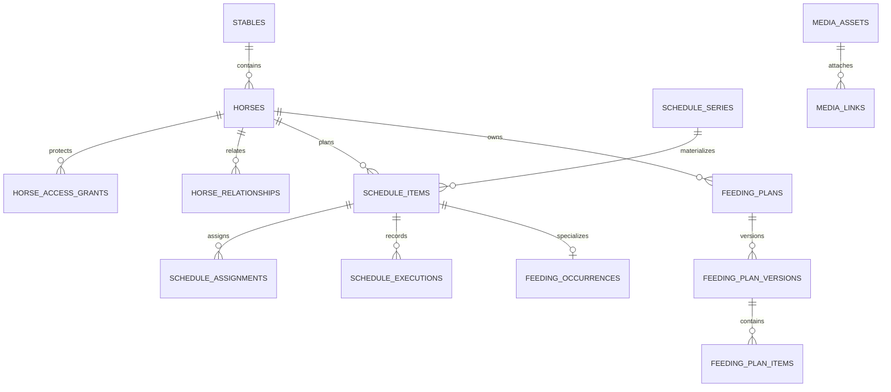

# AVARYN Fase 4C.1 — Datamodel- en beveiligingscontract

**Product:** AVARYN — Global Horse & Rider Performance

**Fase:** 4C.1 — Operationele cloudfundering

**Versie:** 0.9 (besluitrijp ontwerp)

**Datum:** 26 juli 2026

**Status:** bouwklaar ontwerp; nog niet als SQL geïmplementeerd

**Technische basis:** Supabase/PostgreSQL, FlutterFlow, bestaande fase 4A en fase 4B

**Vast herstelpunt fase 4B:** `2c561d4f3a2b87e2ae8c58eee941537205ca59ac`

---

## 1. Doel en beslisgrens

Fase 4C brengt de dagelijkse AVARYN-data gecontroleerd van lokale FlutterFlow-opslag naar Supabase. Fase 4C.1 legt daarvoor eerst één samenhangend contract vast voor:

- paarden en profielhistorie;
- rechten per paard en gegevenscategorie;
- centrale planning, eenmalige en terugkerende taken;
- verantwoordelijkheden en uitvoeringshistorie;
- standaard- en tijdelijke voerschema’s;
- paardmedia;
- realtime verversing;
- begrensd offline werken, idempotente synchronisatie en conflictbehandeling;
- expliciete migratie van bestaande lokale data.

Dit document is geen opdracht om al deze onderdelen in één migratie te bouwen. Het bepaalt de grenzen waarop 4C.2 tot en met 4C.7 afzonderlijk kunnen worden geïmplementeerd en getest.

### 1.1 Bindende veiligheidsregel

Geen volgende 4C-deelfase mag:

- autorisatie afleiden uit een naam, e-mailadres, functietitel, relatiebenaming of clientclaim;
- lokale voorbeeldpaarden of andere prototype-seeds automatisch uploaden;
- operationele data aan de eerste stal of eerste owner toeschrijven zonder expliciete bevestiging;
- Rider-data en Horse-data in hetzelfde rechtenmodel samenvoegen;
- voor kritieke data automatisch `last write wins` gebruiken;
- een directe clientwrite toestaan die rechten, historie of audit kan omzeilen;
- fase-4B-tabellen of RPC-contracten wijzigen zonder een afzonderlijke regressie- en upgradeaudit.

---

## 2. Bestaande basis uit fase 4A en 4B

Fase 4C bouwt voort op de volgende reeds bewezen concepten:

| Object | Autoritatieve identiteit | Verantwoordelijkheid |
| --- | --- | --- |
| `auth.users` | auth-UUID | accountidentiteit en sessie |
| `profiles` | auth-UUID | persoonlijk basisprofiel |
| `stables` | cloud-UUID | tenant/workspace |
| `stable_members` | cloud-UUID | operationele rosterpersoon, ook zonder account |
| `stable_memberships` | cloud-UUID | autoritatieve account-stalrelatie en rol |
| `stable_invitations` | cloud-UUID | beveiligde uitnodigingslifecycle |
| `account_workspace_preferences` | auth-UUID | geselecteerde cloudstal en workspacevoorkeur |
| `stable_security_events` | cloud-UUID | append-only security-audit |

De bestaande rollen blijven:

- `owner`;
- `admin`;
- `member`;
- `viewer`.

De bestaande fase-4B-eigenschappen blijven onaangetast:

- precies één actieve owner per stal;
- geen directe role-, status-, membership- of ownershipwrites;
- membershipmutaties via beveiligde RPC’s;
- raw uitnodigingstokens nooit in database of logs;
- security-events in dezelfde transactie als de mutatie;
- één gedeeld stable-scoped lockprotocol voor lidmaatschapsmutaties;
- accountverwijdering fail-closed zolang eigendom en historie niet veilig zijn afgehandeld.

### 2.1 Nog lokale gegevens

De huidige FlutterFlow-runtime bevat nog account-scoped lokale gegevens voor onder meer:

- paarden en geselecteerd paard;
- activiteiten en planning;
- voedingsplannen;
- tijdelijke voedingsschema’s;
- voerrondes en verantwoordelijkheidsuitzonderingen;
- uitvoeringshistorie;
- lokale monotone ID-tellers;
- lokale stal- en gebruikers-ID’s.

Deze lokale ID’s zijn migratiereferenties en nooit cloudautorisatie-identiteiten.

---

## 3. Scope en niet-doelen

### 3.1 In scope voor het 4C-contract

1. Horse-basisprofiel en historie.
2. Relaties tussen paard en rosterpersoon.
3. Expliciete toegang per paard, categorie en capability.
4. Eén centrale taak-/planningsbron.
5. Terugkerende taken met materialiseerbare occurrences.
6. Toewijzing aan rosterpersonen en uitvoering door gekoppelde accounts.
7. Append-only uitvoeringshistorie.
8. Standaard- en tijdelijke voerschema’s met versiebeheer.
9. Veilige private paardmedia.
10. Idempotente online/offline mutaties.
11. Realtime verversing zonder autorisatie te omzeilen.
12. Expliciete legacy-import met preview, mapping, audit en rollbackpad.

### 3.2 Bewust niet in de eerste 4C-implementatie

- Rider Health, Rider Nutrition en andere private Rider-datasets;
- volledige medische voorschrift- of medicatiemodule;
- FEI-rule-engine en externe submission;
- wedstrijd-, reis- en checklistmodule;
- boxen, paddocks, faciliteiten en volledige Stable Operations;
- centrale commerciële productcatalogus of rantsoenoptimalisatie;
- publieke social feed of chat;
- analytics- of researchkopieën van operationele data;
- automatische import uit federaties, stamboeken of wearables;
- productie-deployment zonder afzonderlijke releasegate.

Het datamodel mag deze latere functies niet blokkeren, maar neemt ze nog niet impliciet mee.

---

## 4. Voorgestelde productbesluiten

De Fase-1-PRD bepaalt dat open permission-, conflict-, privacy- en retentiekeuzes niet stilzwijgend door een ontwikkelaar mogen worden ingevuld. Onderstaande keuzes zijn daarom expliciet. Ze gelden als aanbevolen 4C-baseline en moeten vóór de SQL-bouw als besluit worden bevestigd.

| ID | Aanbevolen besluit | Reden |
| --- | --- | --- |
| 4C-DEC-01 | `stable_id` blijft de tenantgrens voor alle operationele Horse-data. | Sluit aan op fase 4B en voorkomt een tweede autorisatiesysteem. |
| 4C-DEC-02 | Een relatiebenaming zoals trainer, groom, eigenaar of ruiter verleent nooit automatisch toegang. | Relatie en autorisatie blijven aantoonbaar gescheiden. |
| 4C-DEC-03 | Owner heeft beheer over alle Horse-categorieën binnen de eigen stal; admin heeft geen automatische toegang tot gevoelige Health-data; member en viewer krijgen alleen expliciete Horse-grants. | Veilige standaard met werkbare staladministratie. |
| 4C-DEC-04 | Rider-data blijft standaard uitsluitend voor de Rider zelf en krijgt later een afzonderlijk deelcontract. | Voorkomt dat een stalrol private menselijke data opent. |
| 4C-DEC-05 | Een taak toont aan de uitvoerder alleen de minimaal noodzakelijke instructie; een taaktoewijzing opent niet automatisch het volledige Horse-dossier. | Least privilege voor groom- en tijdelijke teamflows. |
| 4C-DEC-06 | Een normale uitvoering/log mag offline; authority-, permission-, planactivatie-, archief- en gevoelige profielmutaties zijn online-only. | Vermindert onoplosbare of risicovolle conflicten. |
| 4C-DEC-07 | Operationele uitvoeringen zijn append-only. Correcties verwijzen naar het oorspronkelijke event en overschrijven dit niet. | Volledige herleidbaarheid van gepland versus werkelijk. |
| 4C-DEC-08 | Terugkerende planning gebruikt één serie plus afzonderlijk gematerialiseerde occurrences. | Today, offline en audit krijgen ieder een stabiele record-ID. |
| 4C-DEC-09 | Voerplannen zijn versiegebonden; een geactiveerde versie wordt niet in-place herschreven. | Historie blijft verklaren wat op dat moment was gepland. |
| 4C-DEC-10 | Tijdelijke voerschema’s vervangen alleen expliciet aangeduide standaardmomenten; geen verborgen heuristiek. | Voorkomt dubbele of ontbrekende voerrondes. |
| 4C-DEC-11 | Media erft altijd de toegang van het gekoppelde object en kan die toegang nooit verruimen. | Een foto-URL wordt geen achterdeur naar Horse-data. |
| 4C-DEC-12 | Hard delete is geen clientfunctie. Paarden, plannen en media worden eerst gearchiveerd/soft-deleted en volgens later retentiebeleid gepurged. | Audit, herstel en wettelijke afhandeling blijven mogelijk. |
| 4C-DEC-13 | Prototype-seeds worden nooit automatisch gemigreerd. Gewijzigde seedrecords blijven “onduidelijk” totdat de gebruiker ze expliciet selecteert. | Voorkomt onjuist eigendom en vervuilde productiegegevens. |
| 4C-DEC-14 | Kritieke taaktypen en vier-ogencontrole blijven uitgeschakeld totdat P0-05/P0-06 professioneel zijn vastgesteld. | De app mag geen medische of veiligheidsbevoegdheid verzinnen. |

---

## 5. Autorisatiemodel

AVARYN gebruikt drie afzonderlijke lagen. Geen van de lagen mag stilzwijgend worden overgeslagen.

1. **Stallidmaatschap** — mag dit account überhaupt binnen deze tenant handelen?
2. **Horse-toegang** — mag dit membership dit paard en deze gegevenscategorie gebruiken?
3. **Object-/actiecontrole** — mag de actor deze concrete taak, uitvoering, planversie of mediahandeling uitvoeren?

### 5.1 Gegevenscategorieën

| Code | Voorbeelden | Gevoeligheid |
| --- | --- | --- |
| `horse.basic` | naam, foto, geboortedatum, geslacht, discipline, niveau, actieve status | normaal operationeel |
| `horse.identity` | chip, paspoort, registratienummer, stamboekbron | verhoogd |
| `horse.team` | semantische relaties met eigenaar, ruiter, groom en trainer | verhoogd |
| `horse.schedule` | taken, training en dagelijkse planning | operationeel |
| `horse.nutrition` | voerplan, supplementen, werkelijke hoeveelheden en afwijkingen | verhoogd |
| `horse.health_summary` | minimaal noodzakelijke zorgwaarschuwing of uitvoerinstructie | gevoelig |
| `horse.health_detail` | diagnose, documenten, behandelhistorie en professionele notities | strikt gevoelig; nog niet gebouwd |
| `horse.media` | foto’s en documenten, beperkt door gekoppelde context | afgeleid |
| `horse.permissions` | relaties, grants en toegangsbeheer | security-kritiek |

### 5.2 Capabilities

| Capability | Betekenis |
| --- | --- |
| `view` | object en toegestane velden lezen |
| `execute` | toegewezen taak uitvoeren of log toevoegen |
| `edit` | inhoud binnen een categorie wijzigen |
| `manage` | delen, grants, archiveren of structurele configuratie beheren |

`manage` impliceert niet automatisch toegang tot Rider-data en mag voor gevoelige categorieën afzonderlijk worden beperkt.

### 5.3 Aanbevolen standaardmatrix

`E` betekent dat een expliciete Horse-grant nodig is. `Min` betekent alleen de minimale toegewezen taakinstructie.

| Handeling/categorie | Owner | Admin | Member | Viewer | Alleen toegewezen |
| --- | ---: | ---: | ---: | ---: | ---: |
| Horse-basislijst bekijken | Ja | Ja | E | E | Min |
| Horse-basisprofiel wijzigen | Ja | Ja | E | Nee | Nee |
| Identificatie bekijken | Ja | E | E | E | Nee |
| Identificatie wijzigen | Ja | E | E | Nee | Nee |
| Teamrelaties bekijken | Ja | Ja | E | E | Min |
| Teamrelaties beheren | Ja | Ja | Nee | Nee | Nee |
| Planning bekijken | Ja | Ja | E | E | Min |
| Taak plannen/wijzigen | Ja | Ja | E | Nee | Nee |
| Toegewezen taak uitvoeren | Ja | Ja | E | Nee | Ja |
| Nutrition bekijken | Ja | E | E | E | Min |
| Nutritionplan wijzigen/activeren | Ja | E | E | Nee | Nee |
| Health summary bekijken | Ja | E | E | E | Min |
| Health detail bekijken | Ja | E | E | E | Nee |
| Horse-grants beheren | Ja | Beperkt | Nee | Nee | Nee |
| Paard archiveren | Ja | Ja | Nee | Nee | Nee |

Aanvullende regels:

- een admin mag zichzelf geen gevoelige grant geven;
- een admin mag geen ownerbevoegdheid nabootsen;
- alleen owner of een al bevoegde grantmanager kan gevoelige grants uitdelen;
- een uitvoerder krijgt alleen via een veilige serverview of RPC de minimale taakdetails;
- een `horse_relationship` is informatief en geeft op zichzelf nul capabilities;
- verlopen, suspended, removed of left memberships hebben onmiddellijk nul servertoegang.

### 5.4 Rider-isolatie

Geen enkele Horse-grant of stalrol verleent toegang tot:

- Rider voeding;
- Rider gezondheid;
- Rider herstel/slaap;
- Rider doelen of privénotities.

Een latere Rider-deelfase krijgt eigen tabellen, permissions en consent. Alleen expliciet gedeelde wedstrijd- of trainingscontext mag Horse en Rider verbinden.

---

## 6. Datamodeloverzicht

Alle nieuwe operationele tabellen bevatten waar relevant redundant `stable_id`. Dit is bewust:

- RLS kan vroeg op tenant filteren;
- samengestelde foreign keys blokkeren cross-stable koppelingen;
- incidentonderzoek hoeft niet via meerdere onbetrouwbare joins de tenant te bepalen.

---

## 7. Horse-tabellen

### 7.1 `horses`

Autoritatief actueel Horse-basisrecord.

| Veld | Type | Regels |
| --- | --- | --- |
| `id` | `uuid` | PK, server-side gegenereerd |
| `stable_id` | `uuid` | FK naar `stables`, verplicht |
| `status` | `text` | `active`, `archived` |
| `display_name` | `text` | verplicht, getrimd, begrensde lengte |
| `official_name` | `text` | optioneel |
| `birth_date` | `date` | optioneel; geen gelijktijdig hard afgeleid leeftijdsveld |
| `sex` | `text` | gecontroleerde waarden plus `unknown` |
| `breed` | `text` | optioneel |
| `discipline` | `text` | optioneel, uitbreidbaar |
| `level` | `text` | optioneel |
| `profile_media_asset_id` | `uuid` | optioneel, zelfde stal/paardcontext |
| `legacy_local_horse_id` | `bigint` | optionele migratiereferentie |
| `source_kind` | `text` | `manual`, `legacy_import`, `external_verified` |
| `row_version` | `bigint` | start 1, verhoogd bij iedere mutatie |
| `created_by_user_id` | `uuid` | server afgeleid |
| `created_request_id` | `uuid` | idempotency |
| `created_at`, `updated_at` | `timestamptz` | server timestamps |
| `archived_at` | `timestamptz` | alleen bij `archived` |

Constraints:

- uniek `(stable_id, id)` voor samengestelde references;
- uniek `(stable_id, legacy_local_horse_id)` waar legacy-ID niet null is;
- `display_name` mag niet leeg zijn;
- `archived_at` moet overeenkomen met status;
- geen directe client-delete;
- geen automatische deduplicatie op naam.

### 7.2 `horse_identifiers`

Identificatie staat apart van het basisprofiel.

| Veld | Type | Regels |
| --- | --- | --- |
| `id` | `uuid` | PK |
| `stable_id`, `horse_id` | `uuid` | samengestelde same-stable FK |
| `identifier_type` | `text` | `chip`, `passport`, `registration`, `studbook`, `other` |
| `identifier_value` | `text` | niet publiek doorzoekbaar |
| `issuer` | `text` | optioneel |
| `country_code` | `text` | optioneel ISO-landcode |
| `source_kind` | `text` | user/professional/official/import |
| `verification_status` | `text` | `unverified`, `verified`, `rejected`, `expired` |
| `valid_from`, `valid_until` | `date` | optioneel |
| `row_version` | `bigint` | optimistic concurrency |
| auditvelden |  | actor, request-ID en timestamps |

Alle reads vereisen `horse.identity:view`. Analytics en standaardlijsten ontvangen nooit de ruwe identifierwaarde.

### 7.3 `horse_relationships`

Semantische relatie tussen een paard en een rosterpersoon.

| Veld | Type | Regels |
| --- | --- | --- |
| `id` | `uuid` | PK |
| `stable_id`, `horse_id` | `uuid` | same-stable FK |
| `stable_member_id` | `uuid` | same-stable roster-FK |
| `relationship_type` | `text` | `owner`, `rider`, `groom`, `trainer`, `veterinarian`, `professional`, `other` |
| `status` | `text` | `active`, `ended` |
| `valid_from`, `valid_until` | `date` | tijdgebonden relatie |
| `label` | `text` | optionele operationele omschrijving |
| auditvelden |  | actor, request-ID, versie, timestamps |

Belangrijk:

- relaties verlenen nul toegang;
- één persoon kan meerdere relaties hebben;
- `owner` in deze tabel is een paardenrelatie en niet de fase-4B-stalowner;
- vrije tekst en relatiebenaming mogen nooit in een RLS-policy als autoriteit dienen.

### 7.4 `horse_access_grants`

Expliciete autorisatie per Horse-categorie.

| Veld | Type | Regels |
| --- | --- | --- |
| `id` | `uuid` | PK |
| `stable_id`, `horse_id` | `uuid` | same-stable FK |
| `membership_id` | `uuid` | same-stable membership-FK |
| `category` | `text` | uitsluitend vaste categoriecheck |
| `can_view` | `boolean` | default false |
| `can_execute` | `boolean` | default false |
| `can_edit` | `boolean` | default false |
| `can_manage` | `boolean` | default false |
| `status` | `text` | `active`, `revoked`, `expired` |
| `valid_from`, `valid_until` | `timestamptz` | optioneel tijdelijk |
| `granted_by_user_id` | `uuid` | server afgeleid |
| `grant_reason` | `text` | verplicht bij gevoelige categorie |
| `row_version` | `bigint` | optimistic concurrency |
| auditvelden |  | request-ID en timestamps |

Constraints:

- maximaal één actuele grant per `(horse_id, membership_id, category)`;
- alleen een actief membership in dezelfde stal;
- capabilitycombinaties worden gevalideerd;
- revoke verwijdert de rij niet;
- iedere mutatie schrijft een `stable_security_event`;
- directe client-DML is volledig ingetrokken.

### 7.5 `horse_profile_change_events`

Append-only audit voor kritieke profielwijzigingen.

- `stable_id`, `horse_id`;
- `actor_user_id`;
- `request_id`;
- `event_type`;
- `changed_fields text[]`;
- `old_values jsonb`;
- `new_values jsonb`;
- `created_at`;
- optionele `reason`.

De server bepaalt welke velden mogen worden opgeslagen. Geen tokens, geheime keys of onbegrensde clientmetadata. Toegang volgt minimaal dezelfde categorie als de gewijzigde gegevens.

---

## 8. Centrale planning en taken

### 8.1 Ontwerpprincipe

Een taak bestaat uit:

1. optioneel een herhalingsserie;
2. één stabiele occurrence in `schedule_items`;
3. nul of meer assignments;
4. een actuele state;
5. append-only uitvoeringen/correcties.

Today, Plan, Horse-detail en teamweergaven lezen hetzelfde bronrecord.

### 8.2 `schedule_series`

Definitie van een terugkerende reeks.

| Veld | Type | Regels |
| --- | --- | --- |
| `id` | `uuid` | PK |
| `stable_id`, `horse_id` | `uuid` | paard optioneel voor stalbrede taak |
| `series_kind` | `text` | `task`, `feeding`, `training`, `care`, `other` |
| `title`, `instruction` | `text` | begrensde operationele tekst |
| `timezone` | `text` | IANA, nooit hardcoded |
| `frequency` | `text` | `daily`, `weekly`, `interval` |
| `interval_value` | `integer` | positief |
| `weekdays` | `smallint[]` | alleen bij weekly |
| `local_start_time` | `time` | lokale intentie |
| `duration_minutes` | `integer` | optioneel, niet-negatief |
| `starts_on`, `ends_on` | `date` | einddatum optioneel |
| `status` | `text` | `draft`, `active`, `paused`, `ended` |
| `generation_horizon_days` | `integer` | begrensd, bijvoorbeeld 60 |
| `row_version` | `bigint` | optimistic concurrency |
| auditvelden |  | actor, request-ID, timestamps |

Een serverprocedure materialiseert occurrences idempotent. Uniek:

`(series_id, occurrence_local_date, occurrence_sequence)`.

Wijzigingen ondersteunen expliciet:

- alleen deze occurrence;
- deze en toekomstige occurrences;
- volledige reeks.

Historische occurrences worden nooit stilzwijgend herschreven.

### 8.3 `schedule_items`

Één concrete geplande occurrence.

| Veld | Type | Regels |
| --- | --- | --- |
| `id` | `uuid` | PK |
| `stable_id` | `uuid` | tenant |
| `horse_id` | `uuid` | optioneel |
| `series_id` | `uuid` | optioneel |
| `item_kind` | `text` | gecontroleerde taakcategorie |
| `data_category` | `text` | bepaalt minimale readpermission |
| `title`, `instruction` | `text` | begrensd |
| `priority` | `text` | `normal`, `high`; `critical` achter feature gate |
| `scheduled_start_at`, `scheduled_end_at` | `timestamptz` | UTC |
| `source_timezone` | `text` | IANA-zone van planning |
| `source_local_date`, `source_local_time` | datum/tijd | bewaart lokale intentie |
| `state` | `text` | `planned`, `in_progress`, `completed`, `skipped`, `cancelled` |
| `row_version` | `bigint` | optimistic concurrency |
| `created_request_id` | `uuid` | idempotent create |
| auditvelden |  | actor en timestamps |

`overdue` is een afgeleide weergavestatus en wordt niet als onafhankelijke bronstatus opgeslagen.

### 8.4 `schedule_assignments`

Toewijzing gebruikt een rosterpersoon, niet een naam.

| Veld | Type | Regels |
| --- | --- | --- |
| `id` | `uuid` | PK |
| `stable_id`, `schedule_item_id` | `uuid` | same-stable |
| `stable_member_id` | `uuid` | uitvoerende rosterpersoon |
| `assignment_role` | `text` | `responsible`, `support`, `reviewer` |
| `status` | `text` | `assigned`, `accepted`, `returned`, `completed`, `cancelled` |
| auditvelden |  | actor, request-ID, timestamps |

Voor de eerste pilot is maximaal één actieve `responsible` per taak toegestaan. Een rosterpersoon zonder account kan worden gepland, maar pas uitvoeren wanneer een actief membership veilig aan dezelfde rosterpersoon is gekoppeld.

### 8.5 `schedule_executions`

Append-only werkelijke uitvoering.

| Veld | Type | Regels |
| --- | --- | --- |
| `id` | `uuid` | PK |
| `stable_id`, `schedule_item_id` | `uuid` | same-stable |
| `actor_user_id` | `uuid` | server afgeleid uit `auth.uid()` |
| `actor_membership_id` | `uuid` | server afgeleid uit `auth.uid()` |
| `actor_stable_member_id` | `uuid` | afgeleid uit membershipkoppeling |
| `execution_status` | `text` | `completed`, `partial`, `skipped`, `refused`, `problem` |
| `actual_started_at`, `actual_completed_at` | `timestamptz` | werkelijke tijden |
| `recorded_local_at` | `timestamp` | lokale apparaattijd |
| `recorded_timezone` | `text` | IANA |
| `source` | `text` | `online`, `offline_sync` |
| `device_instance_id` | `uuid` | willekeurige app-installatie-ID, geen hardware-ID |
| `request_id` | `uuid` | idempotency |
| `note` | `text` | begrensd; geen analyticskopie |
| `corrects_execution_id` | `uuid` | optionele verwijzing naar fout record |
| `created_at` | `timestamptz` | servertijd |

Uniek `(actor_user_id, request_id)` via het mutation-receiptcontract. Een correctie maakt een nieuw event; het oorspronkelijke record blijft bestaan.

### 8.6 Taakstate

De RPC voor uitvoering:

1. valideert actor, membership, assignment en minimale capability;
2. controleert idempotency;
3. vergrendelt de occurrence;
4. schrijft de uitvoering;
5. berekent de nieuwe taakstate;
6. schrijft change-/audit-event;
7. bewaart mutation receipt;
8. commit alles atomair.

Een terminale taak kan niet door een gewone client opnieuw worden geopend. Reopen vereist een aparte bevoegde RPC en auditreden.

---

## 9. Voeding en tijdelijke schema’s

### 9.1 `feeding_plans`

Logische planidentiteit per paard.

- `id`, `stable_id`, `horse_id`;
- `plan_type`: `standard` of `temporary`;
- `name`;
- `status`: `draft`, `active`, `retired`;
- `effective_from`, `effective_until`;
- `created_by_user_id`;
- `row_version`;
- auditvelden.

Er mag per paard en tijdvak maximaal één actieve standaardplanlijn gelden. Een tijdelijk plan mag alleen activeren wanneer iedere override expliciet is.

### 9.2 `feeding_plan_versions`

Immutable inhoudsversie.

- `id`, `stable_id`, `feeding_plan_id`;
- `version_number`;
- `status`: `draft`, `approved`, `superseded`;
- `source_kind`: `user`, `professional`, `verified_template`;
- `source_reference`;
- `change_reason`;
- `approved_by_user_id` en `approved_at`, alleen wanneer werkelijk professioneel/formeel goedgekeurd;
- auditvelden.

Na activatie worden planregels niet in-place gewijzigd. Een wijziging maakt een volgende versie.

### 9.3 `feeding_plan_items`

Eén product-/voerregel binnen een versie.

| Veldgroep | Inhoud |
| --- | --- |
| Product snapshot | merk, productnaam, variant, bronstatus |
| Gepland gebruik | hoeveelheid, eenheid, aanbiedingswijze |
| Moment | ronde-/slotcode, lokale tijd, weekdagen/interval |
| Override | expliciete `override_key` voor tijdelijke vervanging |
| Verantwoordelijkheid | standaard rosterpersoon of onassigned |
| Optioneel | batch/lot, vervaldatum, instructie |

Regels:

- hoeveelheid groter dan nul;
- massa, volume, scoop/portie en stuks via vaste unitcodes;
- geen stille conversie zonder opgeslagen conversiefactor en bron;
- vrije productnaam verleent geen medische of commerciële status;
- AVARYN-producten worden als commerciële bron herkenbaar gehouden.

### 9.4 `feeding_occurrences`

1-op-1-specialisatie van `schedule_items`.

- `schedule_item_id` als PK/FK;
- `feeding_plan_version_id`;
- `feeding_plan_item_id`;
- `planned_quantity`;
- `unit_code`;
- `offering_method`;
- `override_key`;
- `source_plan_type`.

Dit bewaart welk plan en welke versie de occurrence daadwerkelijk hebben gegenereerd.

### 9.5 `feeding_execution_details`

1-op-1-detail bij `schedule_executions`.

- `execution_id` als PK/FK;
- `actual_quantity`;
- `unit_code`;
- `remaining_quantity`;
- `deviation_code`;
- optionele observatie;
- optionele batch/lot.

De generieke executionstatus en de voedingsdetails worden in dezelfde transactie opgeslagen.

### 9.6 Tijdelijk plan en overlap

Activatie van een tijdelijke versie:

1. vergrendelt paard en relevante actieve plannen;
2. valideert effective period;
3. controleert iedere `override_key`;
4. weigert dubbelzinnige overlap;
5. annuleert uitsluitend nog niet uitgevoerde toekomstige occurrences die expliciet worden vervangen;
6. materialiseert nieuwe occurrences idempotent;
7. laat historische planning en uitvoeringen intact;
8. schrijft één planactivatie-event met request-ID.

Er is geen automatische interpretatie dat “ongeveer dezelfde tijd” of “dezelfde productnaam” een vervanging betekent.

---

## 10. Media

### 10.1 Opslagmodel

Paardmedia gebruikt uitsluitend private storage. Een objectkey wordt server-side gegenereerd:

`<stable_id>/<horse_id>/<media_asset_id>/<variant>`

De client mag geen ander stal- of paardpad kiezen.

### 10.2 `media_assets`

- `id`, `stable_id`;
- `status`: `pending`, `ready`, `quarantined`, `archived`, `purged`;
- `bucket_id`, `object_path`;
- `mime_type`, `byte_size`, `sha256`;
- `original_filename` geschoond en niet als objectkey gebruikt;
- `uploaded_by_user_id`;
- `created_request_id`;
- `created_at`, `ready_at`, `archived_at`;
- afgeleide varianten/thumbnails via aparte servermetadata.

### 10.3 `media_links`

Een link heeft exact één ondersteund doel:

- `horse_id`; of
- `schedule_execution_id`; of
- later een expliciet toegevoegd typed object.

Geen onbeschermde combinatie `object_type + willekeurige object_id`. Typed nullable foreign keys plus een checkconstraint behouden referentiële integriteit.

### 10.4 Uploadlifecycle

1. Bevoegde client vraagt een uploadsession aan.
2. Server bepaalt stable, Horse, categorie, asset-ID, pad, limiet en toegestaan MIME-type.
3. Client uploadt naar tijdelijk/pending object.
4. Finalize-RPC controleert object, grootte, hash, MIME en autorisatie opnieuw.
5. Asset wordt `ready` en gekoppeld in één gecontroleerde flow.
6. Alleen kortlevende signed URLs worden geleverd.

Signed URLs, storage keys en uploadtokens worden niet in analytics of duurzame clientlogs opgeslagen.

### 10.5 Afgeleide toegang

Media kan nooit ruimer zichtbaar zijn dan:

- de categorie van het gekoppelde paardobject;
- of de minimale task/executionpermission.

Verwijderen van een media-link maakt het asset niet automatisch openbaar of direct fysiek weg. Archivering en purge zijn afzonderlijke serverprocessen.

---

## 11. Offline, idempotency en synchronisatie

### 11.1 Offline toestemmingsmatrix

| Mutatie | Offline toegestaan | Conflictbeleid |
| --- | ---: | --- |
| Toegewezen normale taak uitvoeren | Ja | append-only + request-ID |
| Voeruitvoering registreren | Ja | append-only + request-ID |
| Niet-kritieke observatie toevoegen | Ja | append-only |
| Horse-basisprofiel wijzigen | Beperkt/nog uit | `expected_row_version`, anders conflict |
| Taakdefinitie of tijd wijzigen | Nee in eerste pilot | online optimistic concurrency |
| Voerplan wijzigen/activeren | Nee | online en planlocks |
| Relatie of Horse-grant wijzigen | Nee | online security-RPC |
| Membership/rol/invitation wijzigen | Nee | bestaand fase-4B-contract |
| Paard archiveren | Nee | online beheerders-RPC |
| Media upload/finalize | Nee | online uploadsession |
| Health/medicatie/compliance | Niet in deze deelfase | professioneel conflictcontract vereist |

### 11.2 `client_mutation_receipts`

Server-side exactly-once-basis.

- `actor_user_id`;
- `request_id`;
- `stable_id`;
- `operation_name`;
- `target_type`, `target_id`;
- veilige resultaatcode en targetversion;
- `created_at`;
- retentie volgens later privacybeleid.

Uniek `(actor_user_id, request_id)`.

Een retry met dezelfde request-ID en hetzelfde contract retourneert hetzelfde veilige resultaat. Dezelfde request-ID met een ander operationeel doel wordt geweigerd.

### 11.3 `stable_change_events`

Payloadarme change feed voor refresh en sync.

- monotone `sequence_id`;
- `stable_id`;
- `entity_type`, `entity_id`;
- `change_kind`;
- `data_category`;
- `row_version`;
- `changed_at`;
- geen vrije tekst of geheime payload.

De client gebruikt dit alleen om bevoegde records opnieuw op te halen. Het event zelf verleent geen toegang.

### 11.4 `sync_conflicts`

Alleen voor vooraf goedgekeurde, niet-kritieke mutaties:

- actor, stable, entity en baseversion;
- begrensde clientpatch;
- serverversion;
- status `open`, `resolved_client`, `resolved_server`, `resolved_merged`;
- resolver, reden en timestamps.

Permission-, membership-, medicatie- en complianceconflicten worden niet automatisch in deze generieke tabel samengevoegd.

### 11.5 Cache en intrekking

- offline data wordt versleuteld opgeslagen;
- alleen toegewezen dagset, noodzakelijke instructies en expliciet toegestane records worden gecachet;
- iedere sync valideert membership en een autorisatieversie vóór nieuwe data;
- bij 401/403, suspended, removed, left of stalarchivering wordt gevoelige cache gewist;
- de app toont `offline`, `wachtend`, `gesynchroniseerd` of `conflict`;
- AVARYN kan een volledig offline apparaat niet onmiddellijk op afstand wissen; die beperking wordt in threat model en privacytekst opgenomen.

---

## 12. Realtime

Realtime is verversing, geen autorisatielaag.

- private Realtime Broadcast-channels zijn de voorkeursroute voor schaalbare operationele updates;
- server-side triggers publiceren uitsluitend payloadarme change-events naar een stable-/Horse-topic;
- channelautorisatie wordt afzonderlijk met RLS op `realtime.messages` afgedwongen;
- Postgres Changes mag alleen als eenvoudigere fallback worden gebruikt nadat de tabel-RLS en belasting onder de pilotmatrix zijn bewezen;
- alleen operationele tabellen met bewezen RLS mogen via Postgres Changes worden gepubliceerd;
- memberships, grants en gevoelige security-events worden niet breed als realtime payload verspreid;
- iedere realtime row blijft door `SELECT`-RLS beschermd;
- de client schrijft niet rechtstreeks via realtime;
- na membership- of grantwijziging sluit de client de betrokken channel, wist context en bouwt abonnementen opnieuw op;
- een reconnect voert altijd een volledige permissioncheck en cursorcatch-up uit;
- events bevatten geen raw identifiers, notities, tokens of signed URLs.

Minimale realtime-scope voor de pilot:

- Horse-basiswijzigingen waarvoor de gebruiker viewpermission heeft;
- schedule-item state;
- assignments;
- nieuwe uitvoeringen;
- planactivatie en gegenereerde occurrences.

Media en grote detailpayloads worden op verzoek opgehaald.

---

## 13. Databasebeveiliging

### 13.1 Default deny

Voor iedere nieuwe tabel:

- RLS aan;
- geen passende policy betekent geen rij;
- `anon` krijgt geen operationele toegang;
- `authenticated` krijgt alleen noodzakelijke reads;
- directe insert/update/delete wordt ingetrokken waar een RPC-contract geldt;
- service role komt nooit in FlutterFlow of clientconfiguratie.

### 13.2 Security-definerregels

Iedere `SECURITY DEFINER`-functie:

- gebruikt `set search_path = ''`;
- kwalificeert alle objectnamen volledig;
- leidt actor af uit `auth.uid()`;
- controleert een geverifieerde sessie;
- vertrouwt niet op clientparameters voor actor, stable, rol of permission;
- herleidt stable via het targetobject en vergelijkt deze met iedere related row;
- valideert actief membership en Horse-capability binnen dezelfde transactie;
- gebruikt een unieke request-ID;
- schrijft audit/change-event in dezelfde transactie;
- heeft execute ingetrokken van `public` en `anon`;
- wordt alleen expliciet aan `authenticated` verleend;
- geeft geen gevoelige foutdetails of accountenumeratie terug.

### 13.3 Samengestelde tenant-FK’s

Kindtabellen gebruiken waar mogelijk:

`FOREIGN KEY (stable_id, horse_id) REFERENCES horses(stable_id, id)`

Hetzelfde patroon geldt voor:

- membership/grant;
- stable member/relationship;
- schedule item/assignment/execution;
- plan/version/item;
- media/objectlink.

Een UUID uit stal B kan daardoor nooit onder `stable_id` van stal A worden gekoppeld.

### 13.4 RLS-helperfuncties

Private helpers leveren alleen booleans en worden niet rechtstreeks aan clients verleend:

- `private.has_active_stable_membership(stable_id)`;
- `private.has_stable_role(stable_id, allowed_roles[])`;
- `private.has_horse_capability(horse_id, category, capability)`;
- `private.can_execute_schedule_item(schedule_item_id)`;
- `private.can_view_media_asset(media_asset_id)`.

Helpers:

- gebruiken `auth.uid()`;
- negeren verlopen grants;
- behandelen suspended/removed/left als deny;
- voorkomen RLS-recursie;
- worden afzonderlijk getest tegen tenantlekken en privilege escalation.

---

## 14. Locking en concurrency

### 14.1 Operationele lockvolgorde

Voor normale Horse-/taskmutaties:

`stable_id/horse_id bepalen zonder relevante rijlock → actor-membership FOR SHARE → relevante Horse-grant FOR SHARE wanneer nodig → targetrow FOR UPDATE → volledige hervalidatie → mutatie → execution/audit/change-event → mutation receipt`

Hierdoor:

- een gelijktijdige membershipverwijdering wacht op een al begonnen geldige uitvoering;
- na commit van verwijdering kan geen nieuwe uitvoering meer starten;
- gewone taakuitvoeringen nemen niet het stable-brede membershipmutatieslot en serialiseren dus niet de hele stal;
- de uitkomst is equivalent aan een geldige seriële volgorde.

### 14.2 Authoritymutaties

Horse-grants, relatiebeheer met toegangsgevolg en andere authoritymutaties volgen:

`stable_id bepalen zonder relevante rijlock → private.lock_stable_membership_mutation(stable_id) → actor/target memberships en grants locken → volledige hervalidatie → mutatie → stable_security_event`

Dit sluit aan op fase 4B en voorkomt een tweede, strijdige lockorde.

### 14.3 Specifieke racecontracten

| Race | Toegestane uitkomst |
| --- | --- |
| dezelfde taak tweemaal met dezelfde request-ID | één execution, identiek idempotent resultaat |
| dezelfde taak terminaliseren met twee verschillende request-ID’s | één geldige terminale state; tweede krijgt idempotente/no-op of domeinrejection volgens taaktype, nul extra event bij no-op |
| uitvoering versus assignment intrekken | één geldige seriële volgorde; uitvoering vóór intrekking kan committen, erna niet |
| uitvoering versus membership remove/suspend | één geldige seriële volgorde; geen execution na gecommitte intrekking |
| Horse update versus archive | update vóór archive of veilige rejection na archive; nooit update op gearchiveerd paard |
| voerplan A versus voerplan B activeren | maximaal één geldige standaardversie voor hetzelfde tijdvak |
| tijdelijke override versus occurrence-uitvoering | reeds uitgevoerde occurrence blijft historisch intact; alleen toekomstige niet-uitgevoerde occurrence kan worden vervangen |
| media finalize versus Horse archive | finalize vóór archive of veilige rejection; geen nieuw zichtbaar asset na archive |

Geen race mag leiden tot:

- `40P01`;
- timeout of hang;
- verloren update;
- dubbele execution;
- ontbrekend audit-/change-event;
- cross-stable koppeling;
- event voor een teruggedraaide transactie;
- wijziging van een controlestal.

---

## 15. Legacy-import en cutover

### 15.1 Principes

- import is altijd opt-in;
- gebruiker kiest expliciet lokale stal en doelcloudstal;
- geen mapping op naam of e-mailadres;
- lokale integer/string-ID blijft als `legacy_*` referentie bewaard;
- prototype-seeds worden standaard uitgesloten;
- dry run toont aantallen, conflicten en onduidelijke records;
- iedere importbatch heeft een UUID-request-ID en is herhaalbaar;
- lokale data blijft intact tot volledige verificatie en expliciete cutover;
- rollback wist niet stilzwijgend historie.

### 15.2 Aanvullende importtabellen

`legacy_import_jobs`

- actor, local-stable fingerprint, cloud stable;
- app/schema/seedversion;
- status `draft`, `validated`, `importing`, `verified`, `cutover`, `failed`, `rolled_back`;
- recordaantallen en veilige hashmanifesten;
- request-ID en timestamps.

`legacy_import_items`

- job-ID;
- entity type;
- legacy local ID;
- cloud ID;
- status;
- fout-/conflictcode zonder gevoelige payload;
- source classification `user`, `modified_seed`, `unmodified_seed`, `unknown`.

### 15.3 Importflow

1. Sla huidige account- en stalscope veilig op.
2. Bereken lokale schema-, seed- en dataversie.
3. Laat gebruiker bronstal en doelstal bevestigen.
4. Toon preview met paarden, taken, plannen en historie.
5. Sluit onveranderde seeds uit.
6. Vereis losse selectie voor gewijzigde seedrecords en onbekende herkomst.
7. Maak/gebruik stabiele mappings voor rosterpersonen en paarden.
8. Importeer in dependencyvolgorde via beveiligde serverbatch.
9. Controleer counts, mappings, permissions en steekproefhashes.
10. Activeer cloudcontext pas na volledige verificatie.
11. Bewaar lokale back-up en rollbackmarker.

Geen enkele stap maakt automatisch de eerste owner tot paardenbezitter of uitvoerder.

---

## 16. RPC-inventaris

### Horse en toegang

- `create_horse`
- `update_horse_profile`
- `archive_horse`
- `upsert_horse_identifier`
- `add_horse_relationship`
- `end_horse_relationship`
- `grant_horse_access`
- `revoke_horse_access`

### Planning en uitvoering

- `create_schedule_item`
- `update_schedule_item`
- `cancel_schedule_item`
- `create_schedule_series`
- `update_schedule_series_scope`
- `materialize_schedule_occurrences`
- `assign_schedule_item`
- `return_schedule_assignment`
- `record_schedule_execution`
- `correct_schedule_execution`
- `reopen_schedule_item` (beperkt en geaudit)

### Voeding

- `create_feeding_plan`
- `create_feeding_plan_version`
- `upsert_feeding_plan_item` (alleen draft)
- `approve_feeding_plan_version`
- `activate_feeding_plan_version`
- `retire_feeding_plan`
- `record_feeding_execution`

### Media

- `create_media_upload_session`
- `finalize_media_asset`
- `link_media_asset`
- `archive_media_asset`

### Sync en import

- `pull_operation_changes`
- `resolve_sync_conflict`
- `create_legacy_import_job`
- `validate_legacy_import_job`
- `execute_legacy_import_batch`
- `verify_legacy_import_job`
- `cutover_legacy_import_job`
- `rollback_legacy_import_job`

De exacte SQL-signatures worden per deelfase vastgelegd. Actor-, stable- en permissionvelden die server-side afleidbaar zijn, worden niet als vertrouwde clientparameters behandeld.

---

## 17. Test- en verificatiematrix

### 17.1 Migratie en schema

- lege database: 4A → 4B → iedere 4C-deelmigratie;
- bestaande definitieve 4B-database → 4C;
- minimaal twee volledige lege resets;
- migratie-upgrade afzonderlijk bewijzen;
- geen drops/herschrijvingen van fase-4A/4B-objecten;
- alle checks, composite FKs, partial unique indexes, grants en execute-rechten inspecteren;
- schema-lint en formattering groen.

### 17.2 RLS en autorisatie

Fixtures:

- owner A, admin A, member A, viewer A;
- owner B en member B;
- account zonder membership;
- suspended, removed en left membership;
- rosterpersoon zonder account;
- twee paarden in stal A, één paard in stal B;
- expliciete grants per categorie;
- toegewezen taak zonder breed dossierrecht.

Bewijzen:

- iedere cel uit de 4C-matrix;
- A → B en B → A volledig deny;
- vervalste relatie, naam, e-mail, metadata en JWT-customclaim geven nul extra toegang;
- admin kan zichzelf geen gevoelige grant geven;
- relationship zonder grant geeft nul dossieraccess;
- task assignment geeft alleen minimale instructie;
- directe DML op authority-, execution-, audit- en plantabellen faalt;
- archive maakt geen historie zichtbaar of onzichtbaar buiten contract;
- Rider-data wordt nergens door een Horse-policy geopend.

### 17.3 Horse

- create is idempotent;
- legacy-ID uniek per stal, niet globaal;
- twee paarden met dezelfde naam toegestaan;
- cross-stable identifier/relationship/grant geblokkeerd;
- optimistic concurrency voorkomt verloren profielupdate;
- archive behoudt planning, executions en audit;
- identifierwaarden ontbreken in standaardlijsten en analytics.

### 17.4 Taken en Today

- one-off en recurrence;
- daily, weekdays en interval;
- DST-start en DST-einde;
- Europe/Amsterdam en Europe/Brussels zonder hardcoding;
- wijzig alleen occurrence, future en full series;
- geen dubbele occurrences bij retries;
- assignment aan linked en unlinked rosterpersoon;
- uitvoering door juiste en verkeerde accountkoppeling;
- planned versus actual actor/time;
- partial, skipped, refused en problem;
- correctie zonder overschrijven;
- deep-link haalt opnieuw permission op;
- Today toont geen dataflits van vorige stal.

### 17.5 Voeding

- standard en temporary;
- immutable geactiveerde versie;
- expliciete override;
- onduidelijke overlap faalt;
- positieve hoeveelheid en geldige unit;
- geen automatische claim of adviesstatus;
- uitgevoerde occurrence blijft intact na planwijziging;
- actual amount en deviation atomair met execution;
- batch/vervaldatum optioneel;
- source status blijft zichtbaar.

### 17.6 Media

- pad wordt server-side bepaald;
- verkeerd stable-/horsepad faalt;
- MIME-, grootte- en hashcontrole;
- pending asset is niet leesbaar;
- link erft categorypermission;
- signed URL is kortlevend;
- ingetrokken grant maakt nieuw URL-verzoek onmogelijk;
- archive versus finalize-race;
- geen tokens of URLs in logs/analytics.

### 17.7 Offline, sync en realtime

- 100 verse idempotency retries zonder dubbele execution;
- verschillende request-ID’s worden niet samengevoegd;
- hergebruik request-ID voor ander doel faalt;
- reconnect voert membership-/grantcontrole uit;
- revoked/suspended gebruiker ontvangt geen nieuwe rows;
- change-event zonder permission geeft geen data;
- cursorcatch-up mist geen updates;
- normale offline execution sync;
- baseversionconflict blijft zichtbaar;
- kritieke mutatie wordt offline geweigerd;
- tijdzone en lokale invoertijd blijven behouden.

### 17.8 Concurrency

Minimaal:

- 50 execution/execution-races;
- 50 execution/unassign-races;
- 50 execution/remove- of suspend-races;
- 50 update/archive-races;
- 50 standaardplan-activatieraces;
- 50 temporary-override/execution-races;
- twintig volledige suites.

Per race:

- afzonderlijke databaseverbindingen;
- betrouwbare clientbarrière;
- unieke request-ID’s;
- volledige deelnemers-, event- en eindtoestandssignatuur;
- nul event voor rollback/rejection/no-op;
- controlestal onaangeroerd.

### 17.9 Legacy-import

- ongewijzigde seeds uitgesloten;
- gewijzigde seed vereist bevestiging;
- account A/B en stal A/B blijven gescheiden;
- herhaalde batch maakt geen duplicaten;
- lokale ID’s byte-identiek als legacyreferentie;
- counts en mappingmanifest kloppen;
- mislukte import activeert geen cloudcutover;
- rollback bewaart lokale bron en audit.

---

## 18. Implementatievolgorde

### 4C.2 — Horse core

- `horses`;
- identifiers;
- relationships;
- Horse-grants;
- profielhistorie;
- RLS, RPC’s, typed SDK en regressies;
- nog geen automatische legacy-upload.

### 4C.3 — Planning en taken

- series, occurrences en assignments;
- execution/audit;
- Today read-model;
- concurrency en deep-linkpermissions.

### 4C.4 — Voeding

- immutable planversies;
- standaard en tijdelijk;
- materialisatie naar schedule-items;
- werkelijke uitvoering.

### 4C.5 — Media

- private bucket;
- uploadsession/finalize;
- media-assets en typed links;
- thumbnails en limieten.

### 4C.6 — Realtime en offline sync

- mutation receipts;
- change feed;
- versleutelde offline dagset;
- conflict- en revoke-flow;
- expliciete legacy-import en cutover.

### 4C.7 — FlutterFlow-integratie

- fase-4B-widgets eerst genereren, compileren en visueel testen;
- Horse-, Today-, Plan- en voedingflows koppelen;
- loading, empty, offline, conflict en permission-denied states;
- end-to-end pilotflows;
- 390 px en 1024 px regressie;
- geen productie-deployment vóór releasegate.

Iedere deelfase krijgt een eigen migratie, testset, documentatie, onafhankelijke audit en commit. Geen “alles-in-één”-migratie.

---

## 19. Acceptatiecriteria voor 4C.1

Fase 4C.1 is ontwerptechnisch gereed wanneer:

1. de voorgestelde besluiten 4C-DEC-01 t/m 4C-DEC-14 expliciet zijn goedgekeurd of aangepast;
2. de role/relationship/permissionmatrix is bevestigd;
3. owner- en adminrechten voor Nutrition en Health ondubbelzinnig zijn;
4. P0-05/P0-06-grenzen voor kritieke taken niet als stilzwijgende functionaliteit worden gebouwd;
5. het fysieke schema tegen de echte fase-4B-migratie en RPC-signatures is gecontroleerd;
6. alle samengestelde tenant-FK’s en RLS-routes uitvoerbaar zijn in de gebruikte Supabase/PostgreSQL-versie;
7. de legacy-seeddetectie tegen de werkelijke FlutterFlow-runtime is bewezen;
8. offline data-encryptie en veilige lokale opslag technisch zijn gekozen;
9. retentie voor audit, mutation receipts, conflicts en media is vastgesteld;
10. 4C.2 een afgebakende, testbare bouwopdracht kan krijgen zonder open autorisatievraag.

---

## 20. Open goedkeuringen vóór SQL

| Besluit | Aanbevolen standaard | Blokkeert |
| --- | --- | --- |
| Mag admin alle Nutrition zien? | Nee, expliciete grant | 4C.2 RLS-helper |
| Mag admin Health detail zien? | Nee, expliciete gevoelige grant | latere Health-module |
| Mogen members standaard de Horse-basislijst zien? | Nee; expliciete grant of minimale assignmentview | Horse-list RLS |
| Wie mag Horse-grants beheren? | Owner; admin alleen niet-gevoelige grants en nooit zichzelf | grant-RPC |
| Wie mag een paard archiveren? | Owner en admin, met auditreden | archive-RPC |
| Offline Horse-profielbewerking? | Uit in eerste pilot | conflictmodel |
| Kritieke taak en tweede controle? | Uit tot professionele validatie | taakstatus en notificaties |
| Auditretentie | Minimaal pilotduur + vastgestelde wettelijke/contractuele periode | purgejobs |
| Mediaretentie na archive | Soft delete, purge na vastgestelde termijn | storage lifecycle |
| Gewijzigde prototype-seeds | Alleen na losse expliciete selectie | importwizard |

---

## 21. Repositoryhandoff

Voor daadwerkelijke bouw moet dit ontwerp eerst in de echte repository worden geplaatst en tegen commit `2c561d4f3a2b87e2ae8c58eee941537205ca59ac` worden gecontroleerd.

Aanbevolen repositorybestand:

`docs/phase-4c1-operational-data-security-contract.md`

De eerste implementatieronde daarna is uitsluitend 4C.2 Horse core. Die ronde mag fase-4B-code alleen additief gebruiken en mag nog geen taken, voeding, media, offline sync, FlutterFlow-codegen of productie-deployment uitvoeren.

---

## 22. Technisch geverifieerde uitgangspunten

De volgende ontwerpkeuzes zijn gecontroleerd tegen de actuele primaire documentatie:

- Supabase gebruikt PostgreSQL Row Level Security als databasegrens voor browser- en clienttoegang: [Supabase Row Level Security](https://supabase.com/docs/guides/database/postgres/row-level-security).
- Een `SECURITY DEFINER`-functie moet een veilige `search_path` gebruiken; bij `search_path = ''` moeten alle objectnamen volledig worden gekwalificeerd: [Supabase Database Functions](https://supabase.com/docs/guides/database/functions).
- Supabase Storage gebruikt RLS-policies voor toegang tot private objecten: [Supabase Storage Access Control](https://supabase.com/docs/guides/storage/security/access-control).
- Supabase beveelt Broadcast aan voor schaalbare en veilige Realtime-abonnementen; Postgres Changes is eenvoudiger maar schaalt minder goed: [Supabase Realtime subscriptions](https://supabase.com/docs/guides/realtime/subscribing-to-database-changes).
- Bij Postgres Changes met RLS worden records alleen gestuurd naar clients die de rij volgens de policy mogen lezen: [Supabase Realtime Authorization](https://supabase.com/docs/guides/realtime/authorization).
- PostgreSQL-rowlocks blokkeren concurrerende writers/lockers op dezelfde rij en worden bij transactie-einde vrijgegeven: [PostgreSQL Explicit Locking](https://www.postgresql.org/docs/current/explicit-locking.html).
